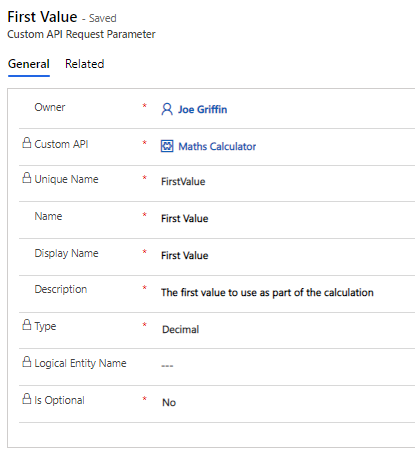
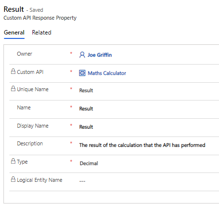

# Custom APIs Demo

This folder contains a C# Class Assembly project and Microsoft Dataverse Managed/Unmanaged Solutions, designed to demonstrate the functionality on offer as part of [Custom APIs](https://docs.microsoft.com/en-us/power-apps/developer/data-platform/custom-api?WT.mc_id=BA-MVP-5003861).

The assets within this folder were first presented as part of a talk I gave during the European Power Platform Conference in Berlin, 2022.

## Outline Scenario

Duff Corporation is a beer company based in Springfield, USA, and Berlin, Germany. The organisation uses the Power Platform and Dynamics 365, particularly Microsoft Dataverse and Dynamics 365 Sales.

As part of some changes required to these systems, the organisation wants the ability to:
- Implement and call some custom order qualification logic within our corresponding Dynamics 365 Sales environment. Salespeople must have the ability to execute automation that will then create a Power Automate approval to the internal accounts team. If the quote is approved, it should be converted to an Order; otherwise, a new Quote revision should be generated. Approval / Rejection comments should also be saved back to the Quote row.
- Execute basic math formulas against our Dataverse environment

All changes must consider any relevant localization concerns to ensure that colleagues speaking both English and German can work with the solution.

## What's Included

- **D365.CustomAPIDemos**: This solution contains a C# class assembly project, with the core login for both Custom APIs. These are built and deployed to Microsoft Dataverse in the same manner as a standard plug-in; the only difference is that no plug-in steps need to be registered.
- **CustomAPIsDemo_1_0_0_1.zip / CustomAPIsDemo_1_0_0_1_managed**: These Dataverse solution files contain the complete definitions for the above Custom APIs, the corresponding plug-in assemblies, a Power Automate cloud flow that triggers the **duff_AccountsApproval** from a selected Quote row and other miscellaneous configuration for the demo.

## Working with the Sample

### Pre-Requisites

The demo relies on functionality present within the [Dynamics 365 Sales application, which must be installed in your targeted Dataverse environment.](https://docs.microsoft.com/en-us/dynamics365/sales/set-up-dynamics-365-sales?WT.mc_id=BA-MVP-5003861).

[Visual Studio](https://visualstudio.microsoft.com/downloads/) will be required to work with the C# assembly project. 2022 is the recommended version to use.

### Plug-in Assembly

1. Clone the repository and re-build the solution to ensure all NuGet dependencies are added.
2. Navigate to the **CustomAPIsForDummies\packages\Microsoft.CrmSdk.XrmTooling.PluginRegistrationTool.9.1.0.148\tools** folder within the cloned repository folder and open the **PluginRegistration.exe** application.
3. Select the **+ Create New Connection** option, login and select your Dataverse environment.
4. Select the **Register** -> **Register New Assembly** button.
5. Select the **...** button, navigate to the plug-in project **bin** folder and load the **D365.CustomAPIs.Demos.dll** assembly.
6. Under the **Step 2** window, tick all the boxes and then press the **Register Selected Plugin** button.
7. The plug-in assembly should register successfully after a few moments.

### Custom API Configuration

There are three core elements to any Custom API configuration, which must be configured correctly for the API to work as expected:

- [Custom API](https://docs.microsoft.com/en-us/power-apps/developer/data-platform/custom-api-tables?tabs=webapi&WT.mc_id=BA-MVP-5003861#custom-api-table-columns): This is the "base" definition for the Custom API. For both the **CustomQuoteApproval** and **MathsCalculator** APIs, define the configuration as indicated below:


- [Custom API Request Parameter](https://docs.microsoft.com/en-us/power-apps/developer/data-platform/custom-api-tables?tabs=webapi&WT.mc_id=BA-MVP-5003861#customapirequestparameter-table-columns): Custom API's typically have at least one, if not several, different input parameters, which is represented here. For both the **CustomQuoteApproval** and **MathsCalculator** APIs, define the configuration as indicated below:




- [Custom API Response Property](https://docs.microsoft.com/en-us/power-apps/developer/data-platform/custom-api-tables?tabs=webapi&WT.mc_id=BA-MVP-5003861#customapiresponseproperty-table-columns): A Custom API can process a set of actions without returning a specific value back, but it's generally best to return some form of output by defining these properties. For both the **CustomQuoteApproval** and **MathsCalculator** APIs, define the configuration as indicated below:




It's recommended that all these definitions are created within a solution.

### CustomAPIsDemo Solution

To experiment with the functionality in the demo without needing to build the plug-in assembly and various configuration properties, you can import the unmanaged / managed versions of the solution.

#### Accounts Approval

The easiest way to trigger the Accounts Approval Custom API is to run the **Trigger Quote -> Order Approval Process** against any Active Quote in the system:


#### Maths Calculator

You can test the endpoint by issuing a GET request against the following endpoint. The example below will perform a simple multiplication:

```
https://orgc0d6ae56.api.crm11.dynamics.com/api/data/v9.2/duff_MathsCalculator(Operator=@p1,FirstValue=@p2,SecondValue=@p3)?@p1=%27multiply%27&@p2=200&@p3=2
```