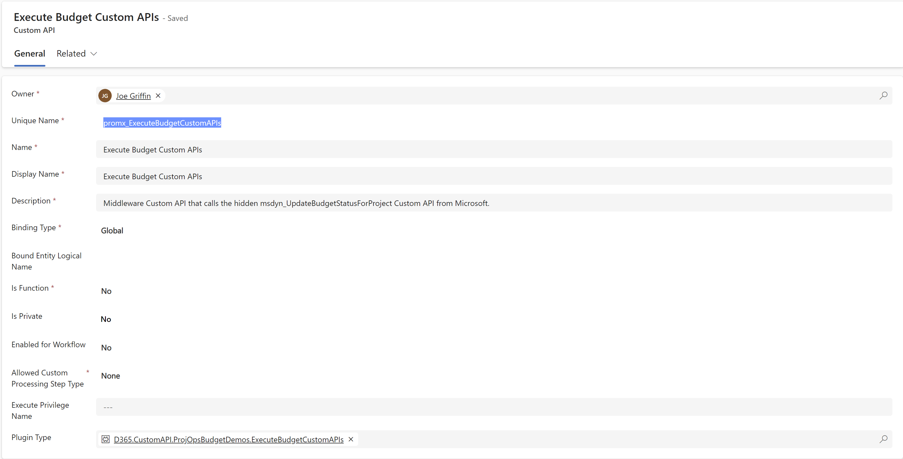
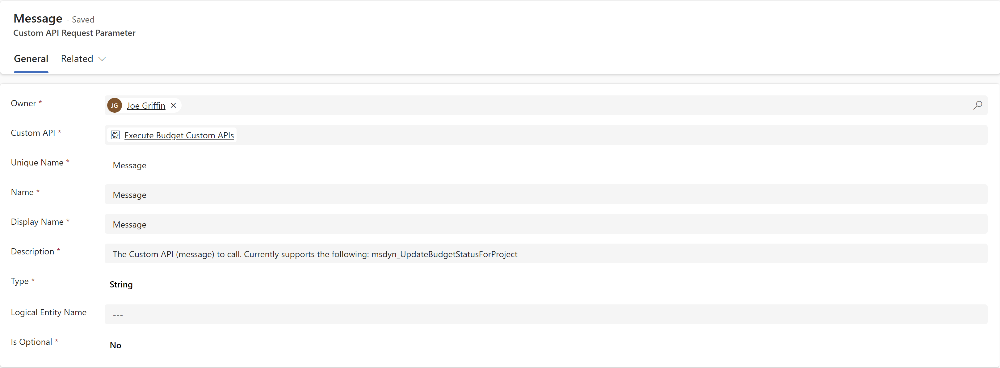
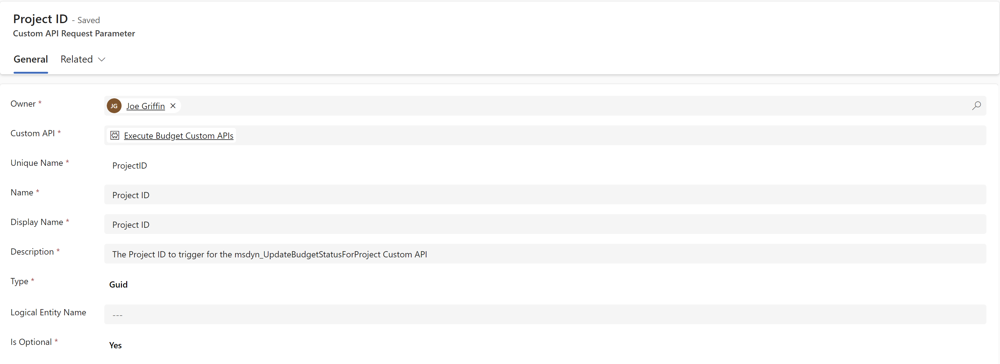
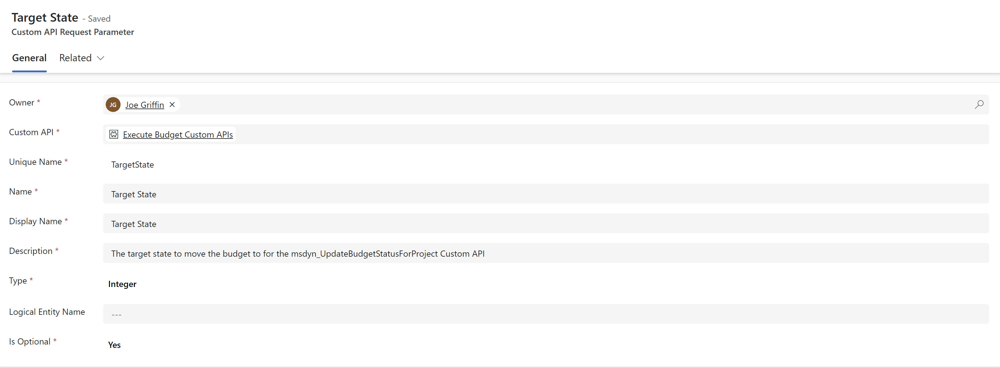

# Project Operations Budget Approval / Rejection Using 

This folder contains a C# Class Assembly project and Microsoft Dataverse Managed/Unmanaged Solutions, designed to demonstrate how the **msdyn_UpdateBudgetStatusForProject** Custom API in [Dynamics 365 Project Operations](https://learn.microsoft.com/en-us/dynamics365/project-operations?WT.mc_id=BA-MVP-5003861) can be called and used as part of a [Power Automate Modern Approval flow](https://learn.microsoft.com/en-us/power-automate/get-started-approvals?WT.mc_id=BA-MVP-5003861).

The assets within this folder were first presented as part of a talk I gave with [Antti Pajunen](https://anttipajunen.com/) as part of the [CX Summit 2023 in Brussels, Belgium](https://d365cxsummit.powercommunity.com/).

**NOTE**: Usage of private Custom API's developed by Microsoft and used in this scenario is unsupported. The sample is designed to present a visionary glimpse at how the feature could be improved in future. Using this within a production scenario is highly discouraged.

## What's Included

- **D365.CustomAPI.ProjOpsBudgetDemos**: This folder contains a C# class assembly project, with the core logic of the public Custom API that is used to call the private Custom API **msdyn_UpdateBudgetStatusForProject**.
- **CXSummitDemos_1_0_0_1.zip / CXSummitDemos_1_0_0_1_managed**: These Dataverse solution files contain the complete definitions for the Custom API, the corresponding plug-in assemblies, a Power Automate cloud flow that demonstrates how to work with the Custom API and other miscellaneous configuration for the demo.

## Working with the Sample

### Pre-Requisites

The demo relies on functionality present within the [Dynamics 365 Project Operations application, which must be installed in your targeted Dataverse environment.](https://learn.microsoft.com/en-us/dynamics365/project-operations/environment/lite-deployment?WT.mc_id=BA-MVP-5003861).

[Visual Studio](https://visualstudio.microsoft.com/downloads/) will be required to work with the C# assembly project. 2022 is the recommended version to use.

This demo relies on functionality as part of [Scott Durow's Smart Buttons for the Ribbon Workbench](https://github.com/scottdurow/RibbonWorkbench), which must be installed in the target environment.

### Plug-in Assembly

1. Clone the repository and re-build the solution to ensure all NuGet dependencies are re-added.
2. Navigate to the **%userprofile%\.nuget\packages\microsoft.crmsdk.xrmtooling.pluginregistrationtool\9.1.0.184\tools** folder and open the **PluginRegistration.exe** application.
3. Select the **+ Create New Connection** option, login and select your Dataverse environment.
4. Select the **Register** -> **Register New Assembly** button.
5. Select the **...** button, navigate to the plug-in project **bin\Debug\net462** folder and load the **D365.CustomAPI.ProjOpsBudgetDemos.dll** assembly.
6. Under the **Step 2** window, tick all the boxes and then press the **Register Selected Plugin** button.
7. The plug-in assembly should register successfully after a few moments.

### Custom API Configuration

There are two core elements which must be configured correctly for the Custom API to work as expected:

- [Custom API](https://docs.microsoft.com/en-us/power-apps/developer/data-platform/custom-api-tables?tabs=webapi&WT.mc_id=BA-MVP-5003861#custom-api-table-columns): This is the "base" definition for the Custom API. For the **promx_ExecuteBudgetCustomAPIs** API, define the configuration as indicated below:

- [Custom API Request Parameter](https://docs.microsoft.com/en-us/power-apps/developer/data-platform/custom-api-tables?tabs=webapi&WT.mc_id=BA-MVP-5003861#customapirequestparameter-table-columns): Custom API's typically have at least one, if not several, different input parameters, which are represented here. For the **promx_ExecuteBudgetCustomAPIs** API, define the configuration as indicated below:

It's recommended that all these definitions are created within a solution.

### CXSummitDemos Solution

To experiment with the functionality in the demo without needing to build the plug-in assembly and various configuration properties, you can import the unmanaged / managed versions of the solution. Once imported, the demo can be executed via the following steps:

1. Navigate to a **Project** row and create a budget. Wait for this operation to complete.
2. Populate the **Budget Approver** field with the details of the user who needs to approve / reject the budget.
3. In the ribbon, select the **Submit Budget** button and confirm the dialog.
4. After a few moments, the approval will be sent out to the user who was marked in the **Budget Approver** field. Observe as well that the budget has now been submitted automatically.
5. Approve or reject the approval and observe the results on the Project.