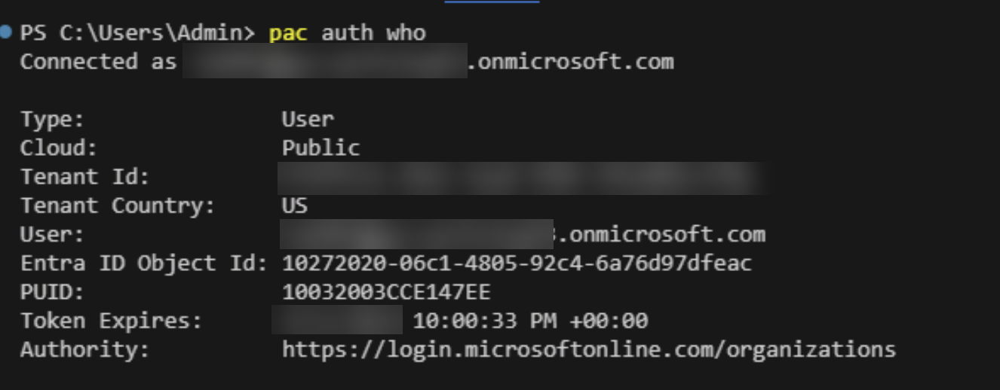

# Lab 0 - Configure Lab Environment

In this lab, you will configure and validate the environment that will be used to complete all subsequent lab exercises.

## Scenario

You have recently been appointed as the low-code developer for WingTip Toys. WingTip Toys has embarked on their Power Platform journey, and you will play a pivotal role as part of the intial explorations into the platform.

As part of your onboarding, you need to validate you have access to the required Microsoft Dataverse environments to build your various apps, data store and automations. In addition, you need to download the [Microsoft Power Platform CLI](https://learn.microsoft.com/en-us/power-platform/developer/cli/introduction?tabs=windows). The CLI is a powerful tool that can support your development workflow across all aspects of the Power Platform and will allow you to experiment working with Power Fx functions from your local machine.

## Instructions

In this lab, you will do the following:

- Setup a Microsoft Dataverse Developer environment on your Microsoft 365 tenant
- Install Visual Studio Code
- Install the Power Platform Tools extension
- Configure an authentication profile to your Developer environment

This lab will take approximately 15 minutes to complete.

> [!IMPORTANT]
> Your admin may have disabled the ability to create a Developer environment on your work tenant. If you encounter any error while attempting to create your developer environment, please reach out to them for further assistance.

## Exercise 1: Create a Microsoft Dataverse Developer Environment

Developer environments allow for any Microsoft 365 user (subject to any tenant level restrictions) to create up to three environments for personal development, testing and other non-production purposes. Each developer environment comes with up to 2GB of Dataverse storage, and allows you to create apps, automations and more.

1. Navigate to the [Power Apps Developer Plan page](https://www.microsoft.com/en-us/power-platform/products/power-apps/free) and click on **Start Free**:

    

2. On the **Build apps with the free Power Apps Developer plan** dialog, enter your email address, tick the consent statement and then click on **Start free**:
    
    

3. When prompted, sign in using your work / Microsoft 365 credentials.

4. You will be automatically redirected to the [Power Apps Maker Portal](https://make.powerapps.com). This may take several minutes to complete.

5. Once the Maker portal loads, a new development environment will have been created for you automatically and will have loaded. You can validate this by checking the following:
   - A banner message reading **This is a developer environment and not meant for production use** is visible on the screen.
   - When selecting the list of Environments, the current environment is shown as **\<Your Name\>'s Environment**.

    

## Exercise 2: Install Visual Studio Code

Visual Studio Code is a lightweight integrated development environment (IDE) that allows developers to code in a variety of languages and work with different services, including the Power Platform. We will install Visual Studio Code on our machines, so that we can install the Power Platform Tools extension in the next exercise. 

> [!IMPORTANT]
> If you already have Visual Studio Code installed on your machine, you can skip this exercise and move to Exercise 3. This exercise assumes you are working from a Windows environment.

1. Navigate to the [Visual Studio Code](https://code.visualstudio.com/) website and click on **Download for Windows**:

    

2. The Visual Studio Code installation executable will start downloading. Once finished, click on **Open file**:

    

3. The executable wizard will open on the **License Agreement** page. Select the radio button to accept the agreement and then click on **Next >**:

    

4. On the **Select Destination Location** page, click on **Next >**:

    

5. On the **Select Start Menu Folder** page, click on **Next >**:

    

6. On the **Select Additional Tasks** page, click on **Next >**:

    

7. On the **Ready to Install** page, click on **Install**:

    

8. The installation will commence. This may take several minutes to complete. Once complete, click on **Finish**:

    

9. Visual Studio Code will open automatically. You can leave the appication window open for the next exercise.

## Exercise 3: Install the Power Platform Tools extension

The Power Platform Tools extension for Visual Studio code provides a streamlined mechanism of working with the Power Platform. It comes bundled with the Power Platform CLI and is, therefore, the preferred mechanism to install and work with the CLI.

> [!IMPORTANT]
> If you already have the Power Platform Tools extension installed on your Visual Studio Code instance, you can skip this exercise and move onto Exercise 4.

1. Open or navigate to an existing Visual Studio Code window, and click on the **Extensions** icon on the left-hand side of the window:

    

2. In the search bar, type **Power Platform Tools** and then click on **Install**:

    

3. The extension will start downloading and installing. Once complete, you will see a screen that resembles the below; this indicates that the extension has been installed successfully:

    

## Exercise 4: Configure an authentication profile

An authentication profile allows us to connect to one, or several, Dataverse environments, directly from Visual Studio Code. We will create an authentication profile to ensure we can connect to our Power Platform environment. 

1. Within Visual Studio Code, select the Power Platform icon and then click on **Add Auth Profile**:

    

2. Sign in using the same login credentials that were used to configure the developer environment in Exercise 1.

3. Once signed in, you will see your developer environment appear in the list underneath **Environments & Solutions**. This may take several minutes to appear:

    

4. Test the new authentication profile by first selecting **Terminal** -> **New Terminal** from the menu:

    

5. In the terminal window, type the following command and then press **Enter**:

    ```
    pac auth who
    ```
6. After a few moments, the terminal window should display details regarding your Power Platform environment, confirming that the profile is configured correctly:

    

7. Leave Visual Studio Code and the terminal window open for the next lab exercise.

**Congratulations, you've finished Lab 0** 🥳