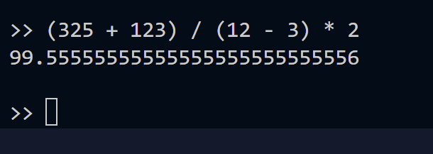
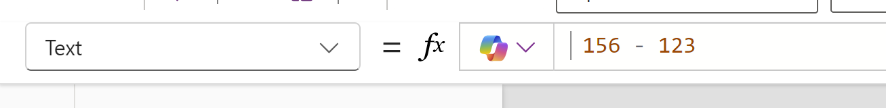
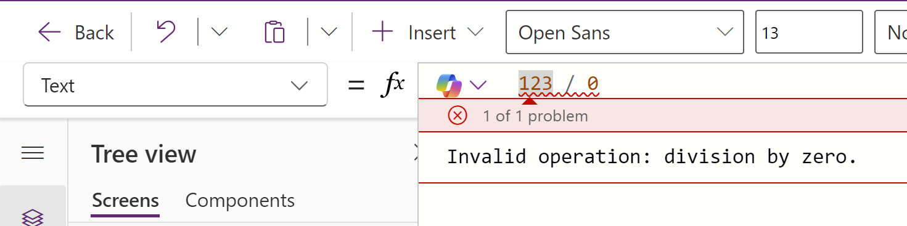
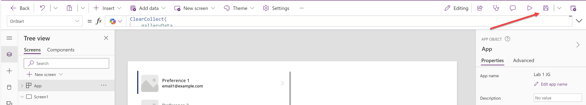
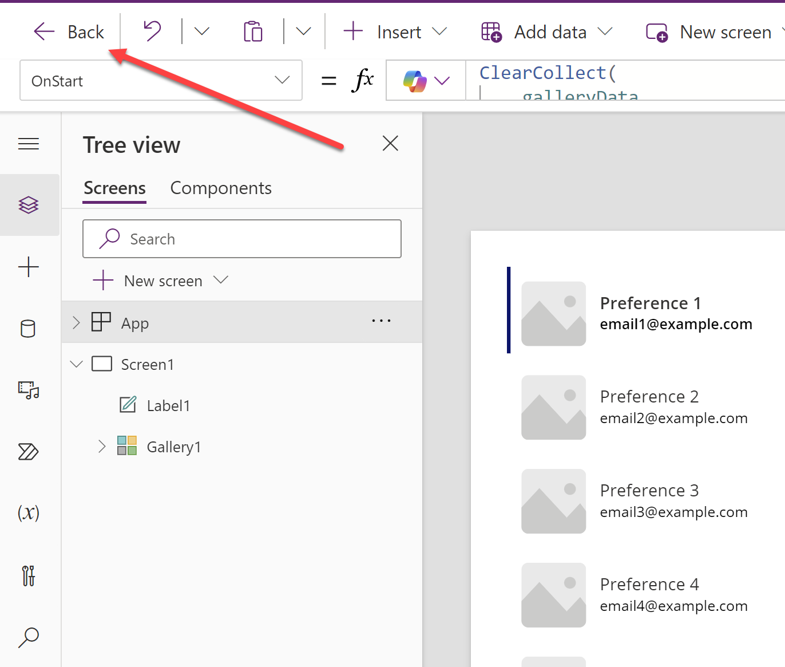

# Lab 1 - Working with Basic Functions

In this lab, you will experiment working with the most common functions in Power Fx, using the interactive Power Fx Read, Evaluation, Print, Loop (REPL) within the PAC CLI.

## Scenario

Having just finished configuring your developer environment for Wingtip Toys, you need to start familiarising yourself with how Power Fx works, and the types of functions you can execute. You plan to use the following experiences to compare and contrast the capabilities on offer:

- The PAC CLI, within a local PowerShell terminal environment.
- A canvas app in the developer environment you provisioned in Lab 0.

Through this experimentation, you plan to gain an understanding of the core functions you will need to use every day when working with Power Fx, and how the different authoring experiences compare.

## Instructions

In this lab, you will do the following:

- Connect to your Dataverse environment using the Power Fx REPL.
- Execute some basic calculations within the PAC CLI.
- Execute some basic functions within the PAC CLI.
- Create a canvas app within the Power Apps Maker portal.
- Implement and execute basic functions within a canvas app, and see how this compares to the PAC CLI.

This lab will take approximately 30 minutes.

> [!IMPORTANT]
> Ensure that all steps have been completed in Lab 0 before proceeding with this lab.

## Exercise 1: Connect to Dataverse from the PAC CLI to execute Power Fx

1. If Visual Studio Code is not open from Lab 0, open it now.
2. Open a new terminal window by selecting **Terminal** from the top menu, and then **New Terminal**:
   
    

3. In the terminal window, type the following command and then press **Enter**:

    ```
    pac power-fx repl
    ```
4. The Power Fx REPL will start. Once connected, you will see a prompt that resembles the below. This indicates that the REPL is ready to receive new commands:

    

## Exercise 2: Execute basic calculations using Power Fx

1. In the Power Fx REPL, type the following command and then press **Enter**:

    ```
    73 + 156
    ```
2. The Power Fx REPL will return the result of the calculation, which should equal `229`:
    
    

3. In the Power Fx REPL, type the following command and then press **Enter**:

    ```
    156 - 123
    ```
4. The Power Fx REPL will return the result of the calculation, which should equal `33`:
    
    

5. In the Power Fx REPL, type the following command and then press **Enter**:

    ```
    (325 + 123) / (12 - 3) * 2
    ```

6. The Power Fx REPL will return the result of the calculation, which should equal `99.55555555555555555555555556`. Notice that Power Fx is able to handle the more complex calculation and return the correct result:
    
    

7. In the Power Fx REPL, type the following command and then press **Enter**:

    ```
    123 / 0
    ```
8. The Power Fx REPL will return an error message, indicating that division by zero is not allowed:

    

9. Rewrite the formula in step 7 by using the **IfError()** function to return a default value of zero if an error occurs and then press **Enter**:

    ```
    IfError(123 / 0, 0)
    ```
10. This time, the Power Fx REPL will return the value of zero, instead of an error:

    

> [!IMPORTANT]
> Division by zero is a common scenario that can cause errors, not just in Power Fx, but in other progamming languages as well. It's always a good idea to handle these scenarios in your any formulas where divisions take place, to prevent any unexpected errors from occurring.

11. Using the previous examples as a guide, experiment with other basic calculations in the Power Fx REPL. For example, attempt to calculate the following values:

 - Sixty five (65) multiplied by twenty three (23).
 - One hundred and twenty three (123) divided by three (3).
 - Combine the previous two calculations into a single formula, that is then divided together.

12. Leave the Power Fx REPL open, as you will use it again in the next exercise.

## Exercise 3: Execute basic functions using Power Fx

1. In the Power Fx REPL, run the following functions to intialize some variables; these will be used throughout the rest of this exercise:

    ```
    Set(varString, "Sample string value."); Set(varNumber, 456); Set(varDate, Date(2024, 10, 15)); Set(varNow, Now())
    ```

    

2. In the Power Fx REPL, type the following command and then press **Enter**:

    ```
    If(varString = "Sample string value.", true, false)  
    ```
3. The Power Fx REPL will return the value `true`, indicating that the variable `varString` is equal to the string value:

    

4. In the Power Fx REPL, type the following command and then press **Enter**:

    ```
    If(varString = "Another sample string value.", true, false)
    ```

5. This time, the Power Fx REPL will return the value `false`, indicating that the variable `varString` is not equal to the new string value:

    

6. In the Power Fx REPL, type the following command and then press **Enter**:

    ```
    varString & " This is a new sentence."
    ```
7. The Power Fx REPL will return the value `Sample string value. This is a new sentence.`:

    

8. In the Power Fx REPL, type the following command and then press **Enter**:

    ```
    Concatenate(varString, " This is a new sentence.")
    ```
9. The Power Fx REPL will return the value `Sample string value. This is a new sentence.`:

    

> [!IMPORTANT]
> Often there will be multiple approaches to achieving the same outcome with Power Fx. In the previous example, both the `&` operator and the `Concatenate()` function were used to concatenate two strings together. Both approaches are valid, but the `Concatenate()` function is more explicit and easier to read. Regardless of which approach you choose, it's important to be consistent in your use of functions and operators throughout your Power Fx formulas.

10. In the Power Fx REPL, type the following command and then press **Enter**:

    ```
    varNumber + 123
    ```

11. The Power Fx REPL will return the result of the addition, `579`:

    

12. In the Power Fx REPL, type the following command and then press **Enter**:

    ```
    Sum(varNumber, 123)
    ```

13. The Power Fx REPL will return the same result as before, `579`:

    

> [!IMPORTANT]
> Usage of the **Sum()** function or the `+` operator will achieve the same outcome. Again, consistency is always key, and you should avoid mixing different approaches within your formulas or apps.

14. In the Power Fx REPL, type the following command and then press **Enter**:

    ```
    Text(varNumber) * 23
    ```

15. Notice that the expected result of `10488` is returned, despite the fact that `varNumber` has been cast as a string; provided that the underlying value is a valid number, Power Fx will automatically convert the string to a number when required:

    

16. In the Power Fx REPL, type the following command and then press **Enter**:

    ```
    Text(DateAdd(varDate, 5), "yyyy-mm-dd")
    ```
17. The Power Fx REPL will return the date `"2024-10-20"`, which is five days after the original date. By default, if the third argument for Units is not specified, **TimeUnit.Days** is used:

    

18. Execute the same function again but this time, specify a Units argument of **TimeUnit.Years**. Observe the new result, which is now `"2025-03-15"`:

    ```
    Text(DateAdd(varDate, 5, TimeUnit.Months), "yyyy-mm-dd")
    ```
    

> [!IMPORTANT]
> Being explicit with the arguments you pass to functions can help to make your formulas more readable and easier to understand.

19. In the Power Fx REPL, type the following command and then press **Enter**:

    ```
    DateDiff(varNow, varDate)
    ```
20. The Power Fx REPL will return the number of day(s) between the two dates. In the example screenshot below, the result is `53`, based on the indicated **varNow** value; the result may vary depending on the current date and time:
    
    

21. In the Power Fx REPL, type the following command and then press **Enter**:

    ```
    DateDiff(varNow + 5, varDate) 
    ```

22. The Power Fx REPL will return the number of days between the two dates. In the example screenshot below, the result is `48`, based on the indicated **varNow** value; the result may vary depending on the current date and time. Notice that it's possible to use arithmetic operators to increase `+` or decrease `-` a date value by days:

    

23. Press `CTRL + C` to exit the Power Fx REPL and close the terminal window.

## Exercise 4: Create a canvas app

> [!IMPORTANT]
> When creating a canvas app, it is generally preferred to [create a solution](https://learn.microsoft.com/en-us/power-platform/alm/solution-concepts-alm) first, alongside a corresponding [solution publisher](https://learn.microsoft.com/en-us/power-platform/alm/solution-concepts-alm#solution-publisher), and to create the app from there. This will help to keep your apps organized and make it easier to deploy them out. For the purposes of this lab, we will skip these steps.

1. Navigate to the [Power Apps Maker Portal](https://make.powerapps.com) and, if not already selected, select the developer environment you created in Lab 0:
   
    

2. Click on **Apps** from the left-hand navigation menu, and then click on **+ New app**. In the sub-menu, select **Start with a page design**:
   
    

3. On the **Start with a page design** screen, select **Blank canvas**:
   
    

4. After a few moments, the Power Apps studio will open. If you see a **Welcome to Power Apps Studio** window, click on **Skip** to proceed to designer view:
   
    

5. In the Power Apps studio, click on the **Insert** tab from the top menu, and then select **Vertical gallery**:
   
    

6. A new gallery control will be added to the app screen. In the formula bar, verify that the **Items** property is selected and modify the formula as follows:

    ```
    ForAll(
        Sequence(20),
        {
            ID: Text(Value),
            Name: "Name " & Text(Value),
            EmailAddress: "email" & Text(Value) & "@example.com",
            DietaryPreferences: "Preference " & Text(Value),
            Budget: 25 * Value
        }
    )
    ```
   
    

7. The gallery will now be populated with twenty sample records:
   
    

8. On the top right of the designer view, click on the **Save** icon:

    

9. In the **Save as** dialog, enter a name value of `Lab 1`, followed by your initials, and then click on **Save**:
   
    

10. Leave the canvas app open, as you will continue working with it in the next exercise.

## Exercise 5: Execute basic Power Fx functions in a canvas app

1. You should still be in the Power Apps studio for the canvas app created in Exercise 4. If not, navigate back to this now.
2. In the designer window, with **Screen 1** selected, click on the **Insert** tab from the top menu, and then select **Label**:
   
    

3. A new label control will be added to the screen. Drag and drop it onto the right-hand side of the screen:

    

4. With the label control selected, navigate to the control property dropdown, select **Color** and configure the formula as indicated below:

    ```
     Color.Red
    ```
   
    

    

5. Repeat the same steps in 4, but this time, select and configure the following properties as indicated in the table below. Once configured correctly, the app screen should resemble the screenshot below:

    | Property | Formula |
    | --- | --- |
    | **Align** | `Align.Center` |
    | **FontWeight** | `FontWeight.Bold` |
    | **Height** | `50` |
    | **Size** | `36` |
    | **Width** | `550` |
    | **X** | `750` |
    | **Y** | `325` |

    

6. Modify the **Text** property of the label to attempt to return a count of all rows from the gallery:

    ```
    CountRows(Gallery1)
    ```

7. Notice that formula returns an error, as the **CountRows()** function supports a table argument only:

    

8. Let's fix the error by creating a collection to store the gallery data instead. First, right click on the **App** option in the Tree view and ensure the **OnStart** property is selected:

    

9. Enter the following formula in the bar, which will initialise a collection with the same data as the gallery:

    ```
    ClearCollect(
        galleryData,
        ForAll(
            Sequence(20),
            {
                ID: Text(Value),
                Name: "Name " & Text(Value),
                EmailAddress: "email" & Text(Value) & "@example.com",
                DietaryPreferences: "Preference " & Text(Value),
                Budget: 25 * Value
            }
        )
    )
    ```
> [!IMPORTANT]
> **ClearCollect** provides a quick and easy way to create a collection and, if one with the same name exists already, delete it and recreate it some scratch. It's therefore recommended to use this as opposed to **Collect** where possible.

10. Select the **Gallery1** control, navigate to the **Items** property and update the property to reference the new collection:

    ```
    galleryData
    ```
    

11. The gallery will display no records. This is because the **OnStart** event has not been executed. Right click the **App** option in the Tree view and select **Run OnStart**:

    

12. The gallery will now display the same records as before:

    

> [!IMPORTANT]
> Usage of the **App.OnStart** is generally discouraged, as it can lead to performance issues with your app. Microsoft have provided an alternative event, the **App.StartScreen** property, that is recommended to be used instead. For the purposes of this simple exercise, usage of **App.OnStart** is acceptable. For further details regarding the **App.StartScreen** property, please refer to the [following blog post](https://www.microsoft.com/en-us/power-platform/blog/power-apps/app-startscreen-a-new-declarative-alternative-to-navigate-in-app-onstart/).

13. Now we can correct the issue with the label control. Modify the **Text** property of the label to return the count of all rows from the collection:

    ```
    CountRows(galleryData)
    ```
14. The label will now display the correct count of records, `20`:

    

> [!IMPORTANT]
> It is generally recommended to always work with collections, so that you have the fullest range of support when using different Power Fx functions. In addition, collections can afford several performance benefits for your applications.

15. Modify the **Text** property of the label to return the sum of all the Budget values from the collection:

    ```
    Sum(galleryData, Budget)
    ```
16. The label will now display the correct sum of all Budget values, `5250`; however, it is not formatted as a proper currency value:

    
    
17. Modify the **Text** property of the label to return the sum of all the Budget values from the collection, formatted as a currency value:

    ```
    Text(Sum(galleryData, Budget), "$#,###.00")
    ```

18. The label will now display the correct sum of all Budget values, `5,250.00`, formatted as a currency value. The preceding currency symbol will always be formatted based on the locale of the user; in the example screenshot below, `en-gb` locale is configured, meaning that the GBP symbol is used:

    

19. The **Text** function supports overrides for the user locale. Modify the formula again, but this time, specify the locale code for Germany, `de-DE`:

    ```
    Text(Sum(galleryData, Budget), "$#,###.00", "de-DE")
    ```
20. The label will now display the correct sum of all Budget values, `5.250,00`, formatted with the correct EUR currency symbole for Germany:

    

21. Modify the **Text** property of the label to return a conditional count of all rows in the **galleryData** control, where the **ID** value is greater than `5`:

    ```
    CountIf(galleryData, Value(ID) > 5)
    ```
22. The label will now display the correct count of records, `15`:

    

23. Experiment further with the label control, and see if you can get the label to display the following information. Use the [Power Fx formula reference for canvas apps documentation to help you if you get stuck](https://learn.microsoft.com/en-us/power-platform/power-fx/formula-reference-canvas-apps):

 - The average value of the **Budget** column.
 - The maximum value of the **Budget** column.
 - The minimum value of the **Budget** column.
 - The **Budget** value from the first record in the **galleryData** collection.
 - The **EmailAddress** value from the last record in the **galleryData** collection.

24. Save the app and your changes by clicking on the **Save** icon in the top right of the designer view:

    

25. Click on the **Back** button on the top right of the screen to return to the Power Apps maker portal, and press **Leave** to confirm; we will not be returning to this app in the next lab:

    

    

**Congratulations, you've finished Lab 1** 🥳