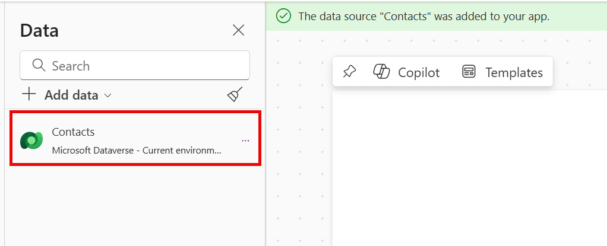

# Lab 2 - Using Power Fx in Canvas Power Apps

In this lab, you will create a basic canvas app that connects to Microsoft Dataverse, to allow users to view, edit and create Contact records. You will then extend the app to include a simple Power Fx formula to calculate the age of each Contact record and to display weather information relating to the Contact's location, via a Power Automate cloud flow.

## Scenario

Wingtip Toys require a simple application that allows sales people to view, edit and create Contact records. The app should also display the age of each Contact record and the current weather information for the Contact's location, to assist the sellers in conducting more personalised conversations with their customers.

Having spent some time familiarising with the fundamental capabilities of Power Fx and Power Apps, you have been tasked with creating a simple canvas app that allows the sellers to work with the Contact records, and support the additional requirements relating to the age of the Contacts and the weather information for each individual.

## Instructions

In this lab, you will do the following:

- Create a simple two screen application, with navigation between the screens.
- Customise each app screen to display a list of all Contacts and a form level view for a single Contact.
- Add a Power Fx formula to calculate the age of each Contact record.
- Add a Power Automate cloud flow to retrieve the weather information for the Contact's location.
- Review and implement recommendations from the Power Apps app checker.

This lab will take approximately 30 minutes to complete.

> [!IMPORTANT]
> Ensure that all steps have been completed in Lab 0 before proceeding with this lab.

## Exercise 1: Create a Canvas App

> [!IMPORTANT]
> When creating a canvas app, it is generally preferred to [create a solution](https://learn.microsoft.com/en-us/power-platform/alm/solution-concepts-alm) first, alongside a corresponding [solution publisher](https://learn.microsoft.com/en-us/power-platform/alm/solution-concepts-alm#solution-publisher), and to create the app from there. This will help to keep your apps organized and make it easier to deploy them out. For the purposes of this lab, we will skip these steps.

1. Navigate to the [Power Apps Maker Portal](https://make.powerapps.com) and, if not already selected, navigate to the developer environment you created in Lab 0:
   
    

2. Click on **Apps** from the left-hand navigation menu, and then click on **+ New app**. In the sub-menu, select **Start with a page design**:
   
    

3. On the **Start with a page design** screen, select **Blank canvas**:
   
    

4. After a few moments, the Power Apps studio will open. If you see a **Welcome to Power Apps Studio** window, click on **Skip** to proceed to designer view:
   
    

5. In the Power Apps studio, click on the **Screen1** label in the left-hand tree view, and rename the screen to **Contact Screen**:

    

> [!IMPORTANT]
> You can also double click any control or screen property to rename it.

6. Add a new screen to the app by clicking on the **+ New Screen** button and selecting the **Blank** screen template:

    

7. Rename the new screen to **Contact Form**. Your app navigation view should resemble the below if done correctly:

    

8. We will now add in the **Contact** table from Microsoft Dataverse as a data source. Click on the **Data** tab in the left-hand menu, and then click on **+ Add data**:

    

9. A list of tables from the current environment will display, with the **Contacts** table option visible. Select it if so; otherwise, search for and then select the table from the list:

    

10. After a few moments, the **Data** pane will refresh and display the **Contacts** table:

    

11. On the top right of the designer view, click on the **Save** icon:

    

12. In the **Save as** dialog, enter a name value of `Lab 2`, followed by your initials, and then click on **Save**:
   
    

13. Leave the canvas app open, as you will continue working with it in the next exercise.

## Exercise 2: Add a Gallery and Form to the Canvas App

## Exercise 3: Add a Power Fx formula to calculate the age of each Contact record

## Exercise 4: Add a Power Automate cloud flow to retrieve weather information

## Exercise 5: Review and implement recommendations from the Power Apps app checker