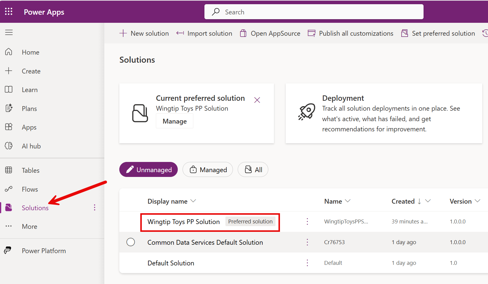
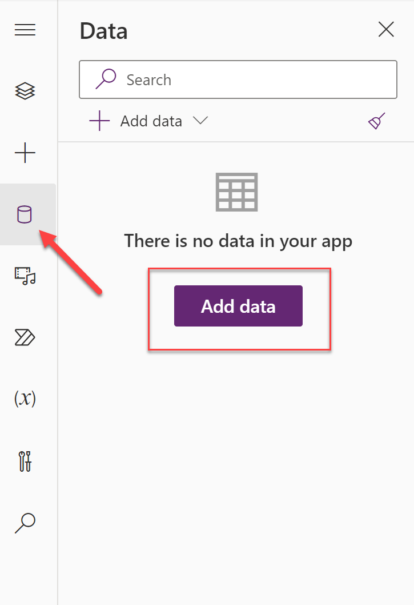
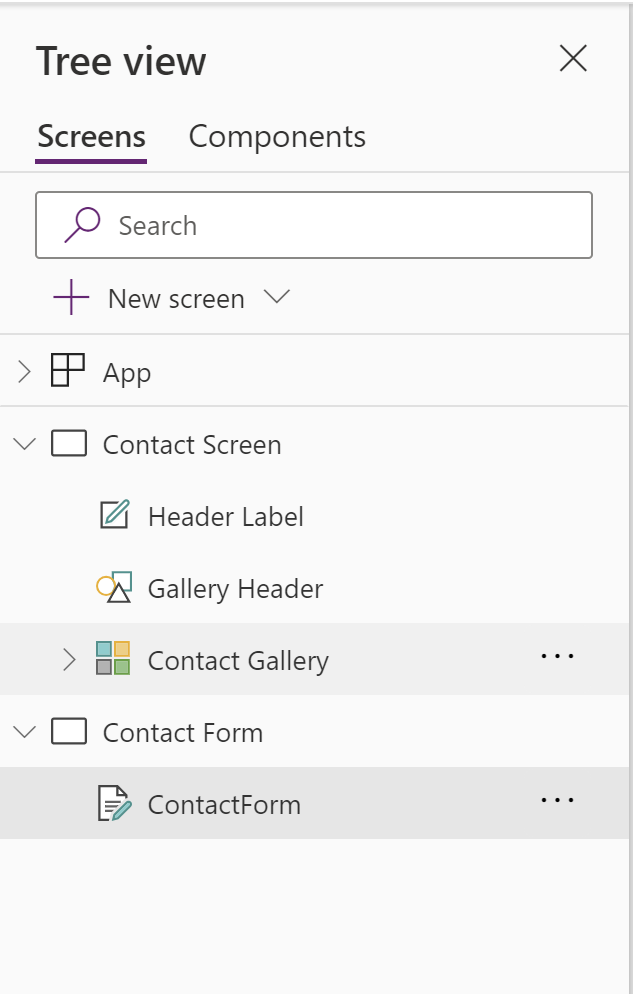

# Lab 2 - Using Power Fx in Canvas Power Apps

In this lab, you will create a basic canvas app that connects to Microsoft Dataverse, to allow users to view, edit and create Contact records. You will then extend the app to include a simple Power Fx formula to calculate the age of each Contact record and to display weather information relating to the Contact's location, via a Power Automate cloud flow.

## Scenario

Wingtip Toys require a simple application that allows sales people to view, edit and create Contact records. The app should also display the age of each Contact record and the current weather information for the Contact's location, to assist the sellers in conducting more personalised conversations with their customers.

Having spent some time familiarising with the fundamental capabilities of Power Fx and Power Apps, you have been tasked with creating a simple canvas app that allows the sellers to work with the Contact records, and support the additional requirements relating to the age of the Contacts and the weather information for each individual.

## Instructions

In this lab, you will do the following:

- Create a simple two screen application, with navigation between the screens.
- Customise each app screen to display a list of all Contacts and a form level view for a single Contact.
- Add several Power Fx formulas for navigation and to calculate the age of each Contact record.
- Add a Power Automate cloud flow to retrieve the weather information for the Contact's location.
- Review and implement recommendations from the Power Apps app checker.

This lab will take approximately 30 minutes to complete.

> [!IMPORTANT]
> Ensure that all steps have been completed in Lab 0 before proceeding with this lab.

## Exercise 1: Create a Canvas App

> [!IMPORTANT]
> When creating a canvas app, it is generally preferred to [create a solution](https://learn.microsoft.com/en-us/power-platform/alm/solution-concepts-alm) first, alongside a corresponding [solution publisher](https://learn.microsoft.com/en-us/power-platform/alm/solution-concepts-alm#solution-publisher), and to create the app from there. This will help to keep your apps organized and make it easier to deploy them out. For the purposes of this lab, we will skip these steps.

1. Navigate to the [Power Apps Maker Portal](https://make.powerapps.com) and, if not already selected, navigate to the developer environment you created in Lab 0:
   
    

2. Click on **Apps** from the left-hand navigation menu, and then click on **+ New app**. In the sub-menu, select **Start with a page design**:
   
    

3. On the **Start with a page design** screen, select **Blank canvas**:
   
    

4. After a few moments, the Power Apps studio will open. If you see a **Welcome to Power Apps Studio** window, click on **Skip** to proceed to designer view:
   
    

5. In the Power Apps studio, click on the **Screen1** label in the left-hand tree view, and rename the screen to **Contact Screen**:

    

> [!IMPORTANT]
> You can also double click any control or screen property to rename it.

6. Add a new screen to the app by clicking on the **+ New Screen** button and selecting the **Blank** screen template:

    

7. Rename the new screen to **Contact Form**. Your app navigation view should resemble the below if done correctly:

    

8. We will now add in the **Contact** table from Microsoft Dataverse as a data source. Click on the **Data** tab in the left-hand menu, and then click on **+ Add data**:

    

9. A list of tables from the current environment will display, with the **Contacts** table option visible. Select it if so; otherwise, search for and then select the table from the list:

    

10. After a few moments, the **Data** pane will refresh and display the **Contacts** table:

    

11. On the top right of the designer view, click on the **Save** icon:

    

12. In the **Save as** dialog, enter a name value of `Lab 2`, followed by your initials, and then click on **Save**:
   
    

13. Leave the canvas app open, as you will continue working with it in the next exercise.

## Exercise 2: Design the Canvas App

1. In the `Lab 2` canvas app, ensure that the **Tree view** icon is selected:

    

2. On the ribbon, click on the **Insert** tab, and then click on **Vertical gallery**:

    

3. Rename the newly inserted **Gallery1** control to **Contact Gallery**:

    

> [!IMPORTANT]
> Although the process of renaming screens and controls may seem tedious, having useful and descriptive names will help when writing formulas later in the lab.

4. Select the **Contact Gallery** control, and with the **Items** property selected in the dropdown, change the value to `Contacts`:

    

5. Repeat the same steps in 4, but this time, select and configure the following properties as indicated in the table below. Once configured correctly, the app screen should resemble the screenshot below:

    | Property | Formula |
    | --- | --- |
    | **Height** | `680` |
    | **Size** | `36` |
    | **Width** | `1366` |
    | **X** | `0` |
    | **Y** | `88` |

    

> [!IMPORTANT]
> If you see no sample data in the gallery, then you may need to install this into your environment. Select the gear icon in the top right corner of the screen, and then click on **Advanced settings**. Next, click the chevron next to **Settings** and then select **Data Management**. On the **Data Management** screen, click on **Sample data** and then click on the **Install sample data** button. Installation may take a few minutes to complete. You can return to the canvas app and refresh the **Contacts** data source to see the sample data in the gallery. For further details on installing sample data, refer to the [Microsoft Learn article](https://learn.microsoft.com/en-us/power-platform/admin/add-remove-sample-data).

6. On the ribbon, click on the **Insert** tab, and then click on **Rectangle**:

    

7. Rename the newly inserted **Rectangle1** control to **Gallery Header**:

    

8. Select the **Gallery Header** control, and with the **Fill** property selected in the dropdown, change the value to `RGBA(250, 155, 112, 1)`:

    

9. Repeat the same steps in 8, but this time, select and configure the following properties as indicated in the table below. Once configured correctly, the app screen should resemble the screenshot below:

    | Property | Formula |
    | --- | --- |
    | **Height** | `88` |
    | **Width** | `1366` |
    | **X** | `0` |
    | **Y** | `0` |

    

10. On the **Gallery Header** control, click on the **Insert** tab, and then click on **Text label**:

    

11. Rename the newly inserted **Label1** control to **Header Label**:

    

12. Select the **Header Label** control, and with the **Text** property selected in the dropdown, change the value to `Wingtip Toys Contacts`:

    

13. Repeat the same steps in 12, but this time, select and configure the following properties as indicated in the table below. Once configured correctly, the app screen should resemble the screenshot below:

    | Property | Formula |
    | --- | --- |
    | **Align** | `Align.Center` |
    | **Color** | `RGBA(255, 255, 255, 1)` |
    | **FontWeight** | `FontWeight.Bold` |
    | **Height** | `60` |
    | **Size** | `24` |
    | **Width** | `380` |
    | **X** | `493` |
    | **Y** | `14` |

    

14. With the **Tree view** icon selected, click on the **Contact Screen** screen in the tree view:

    

15. On the **Contact Screen** screen, click on the **Insert** tab, and then click on **Edit form**:

    

> [!IMPORTANT]
> You may need to scroll down to see the **Edit form** option.

16. Rename the newly inserted **Form1** control to **ContactForm**:

    

17. Select the **ContactForm** control, and with the **DataSource** property selected in the dropdown, change the value to `Contacts`:

    

18. Repeat the same steps in 17, but this time, select and configure the following properties as indicated in the table below. Once configured correctly, the app screen should resemble the screenshot below:

    | Property | Formula |
    | --- | --- |
    | **BorderThickness** | `2` |
    | **Height** | `679` |
    | **Item** | `'Contact Gallery'.Selected` |
    | **Width** | `950` |
    | **X** | `124` |
    | **Y** | `89` |

    

19. With the **ContactForm** control selected, select the **Edit fields** button in the properties pane:

    

> [!IMPORTANT]
> In all of the previous lab steps, we could have used the properties pane to modify font size, color, height, width and a range of other properties. Use whichever experience you prefer when building your own apps.

20. In the **Edit fields** pane, click on the **Add field** button:

    

21. In the **Add a field** dialog, search for and tick the box next to the **Full Name** field:

    

22. Repeat step 21, but this time, search and tick the box for the following fields. Once all fields are ticked, click on the **Add** button:
    
    - **Last Name**
    - **Email**
    - **Birthday**
    - **Business Phone**
    - **Address 1**

23. After a few moments, the form control should refresh itself and resemble the below:

    

24. Navigate back to the **Contact Screen** screen in the tree view.

25. With the `CTRL` key held down, select the following controls in the tree view:
    - **Header Label**
    - **Gallery Header**

    

26. In the ribbon, select the **Copy** option:

    

27. Navigate to the **Contact Form** screen in the tree view and then click on the **Paste** icon. The shape and label will be copied into the correct position, as indicated below:

    

28. Rename the newly pasted **Header Label_1** control to **Form Label** and **Gallery Header_1** control to **Form Header**:

    

29. Adjust the **Text** property of the **Form Label** control to `Contact Details`:

    

30. On the **Contact Screen** screen, click on the **Insert** tab, and then search for and select the **Back arrow** control:

31. Rename the newly inserted **Arrow1** control to **Back Arrow**:

    

32. Select the **Back Arrow** control, and with the **Height** property selected in the dropdown, change the value to `150`:

    

33. Repeat the same steps in 32, but this time, select and configure the following properties as indicated in the table below. Once configured correctly, the app screen should resemble the screenshot below:

    | Property | Formula |
    | --- | --- |
    | **Width** | `124` |
    | **X** | `0` |
    | **Y** | `89` |

    

34. On the **Contact Screen** screen, click on the **Insert** tab, and then search for and select the **Button** control:

    

35. Rename the newly inserted **Button1** control to **Get Weather**:

    

36. Select the **Get Weather** control, and with the **Text** property selected in the dropdown, change the value to `"Get Weather"`:

    

37. Repeat the same steps in 36, but this time, select and configure the following properties as indicated in the table below. Once configured correctly, the app screen should resemble the screenshot below:

    | Property | Formula |
    | --- | --- |
    | **X** | `1144` |
    | **Y** | `408` |

    

38. On the **Contact Screen** screen, click on the **Insert** tab, and then search for and select the **Label** control:

    

39. Rename the newly inserted **Label1** control to **Weather Label**:

    

40. Select the **Weather Label** control, and with the **Text** property selected in the dropdown, change the value to `"REPLACEME"`:

    

41. Repeat the same steps in 40, but this time, select and configure the following properties as indicated in the table below. Once configured correctly, the app screen should resemble the screenshot below:

    | Property | Formula |
    | --- | --- |
    | **FontWeight** | `FontWeight.Bold` |
    | **Height** | `260` |
    | **Width** | `250` |
    | **X** | `1099` |
    | **Y** | `118` |

    

42. Save all changes to the canvas app by clicking on the **Save** icon in the top right corner of the screen.

    

We now have a basic application that allows us to view Contact record data and drill into a single Contact record. In the next exercises, we will add the necessary Power Fx formulas to navigate between screens, calculate and display the age of a Contact and allow the user to dynamically display weather information for the Contact's location.

## Exercise 3: Implement Power Fx Formulas

## Exercise 4: Add a Power Automate cloud flow to retrieve weather information

## Exercise 5: Review and implement recommendations from the Power Apps app checker