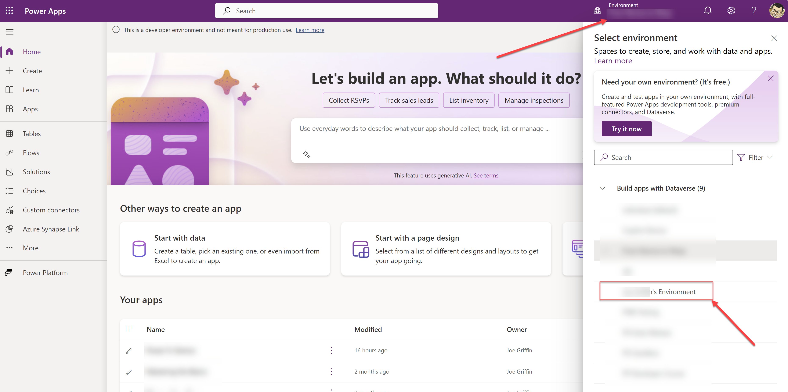
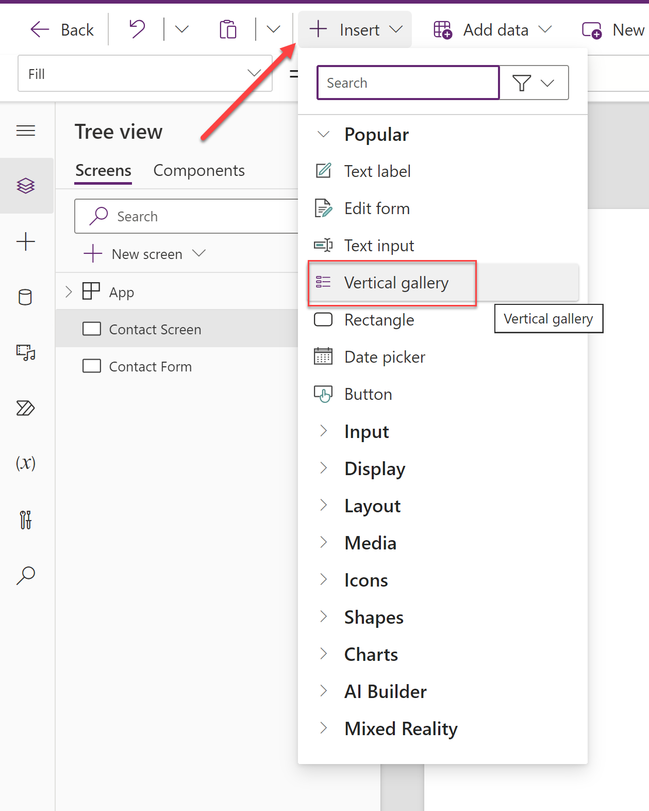
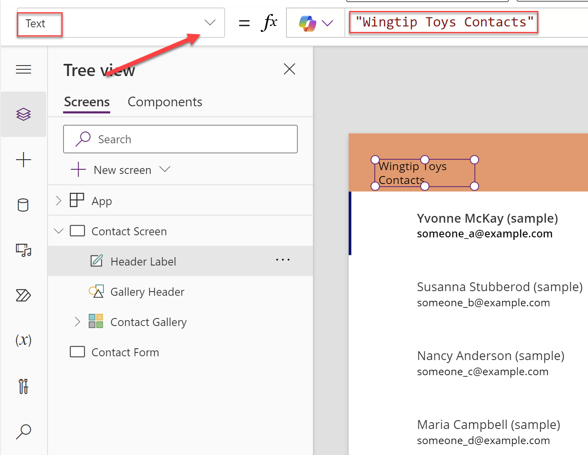
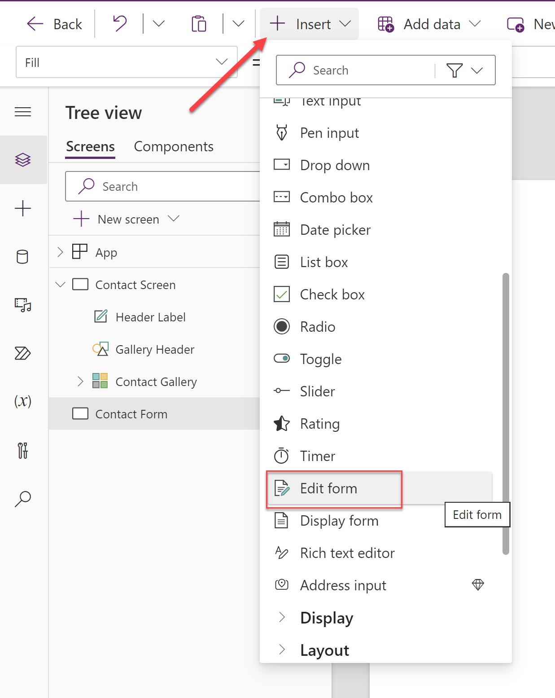
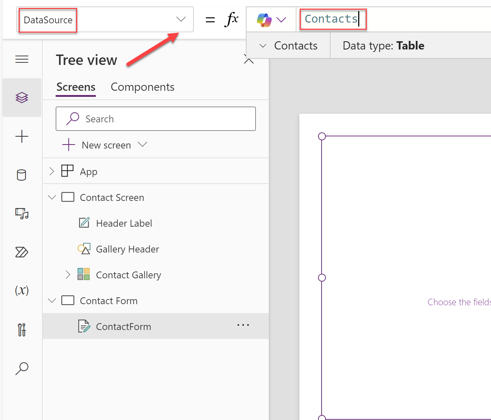
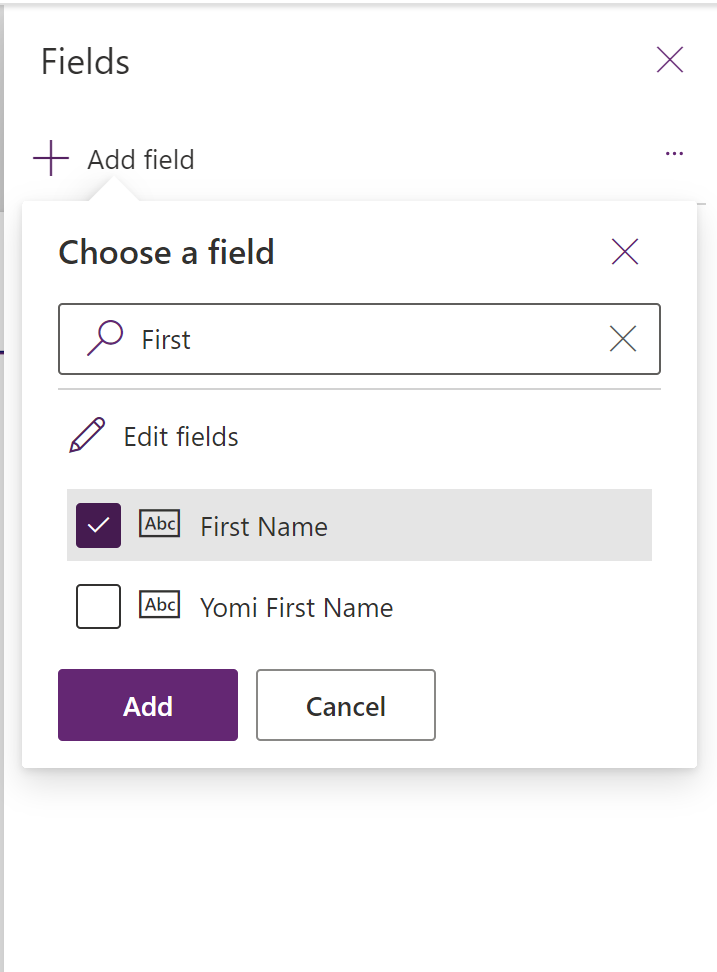
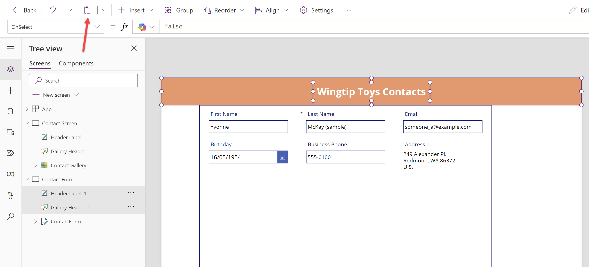
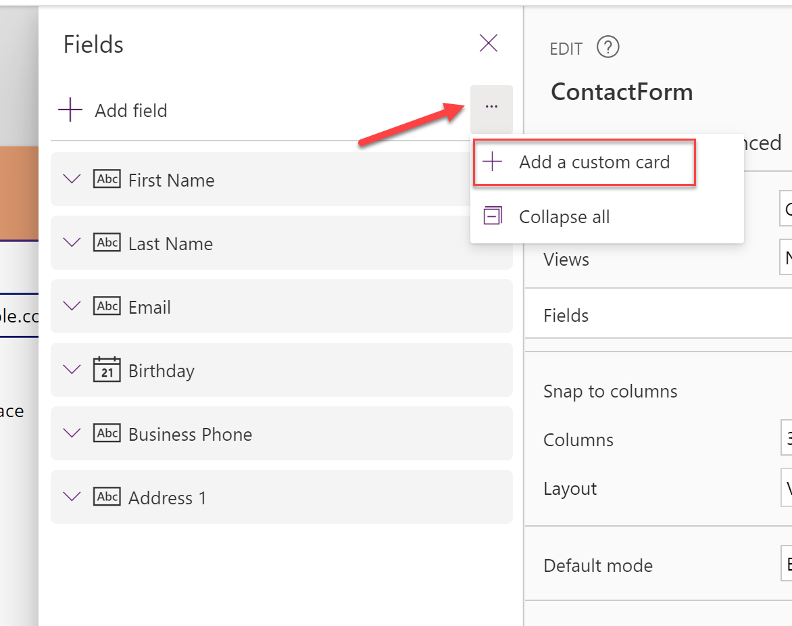
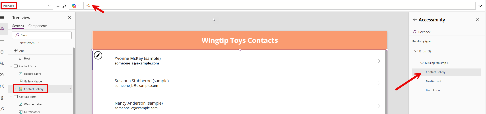
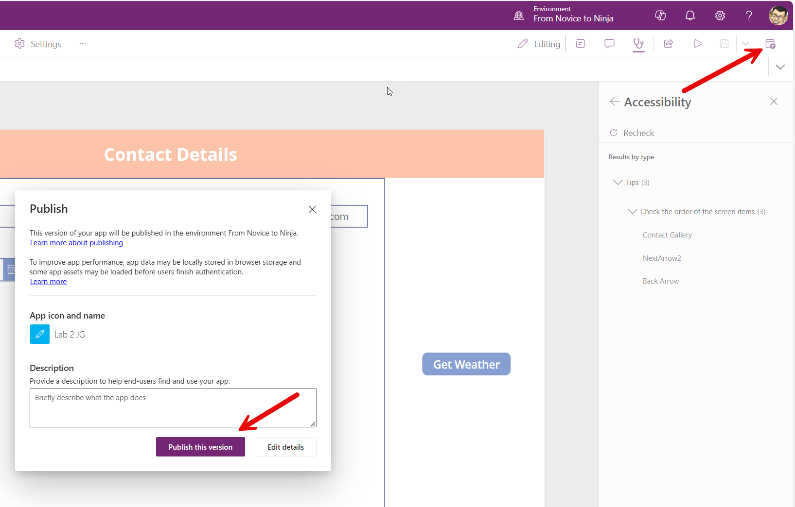

# Lab 2 - Using Power Fx in Custom Pages

In this lab, you will create a basic custom page that connects to Microsoft Dataverse, to allow users to view, edit and create Contact records. You will then extend the page to include a simple Power Fx formula to calculate the age of each Contact record and to display weather information relating to the Contact's location, via a Power Automate cloud flow.

## Scenario

Wingtip Toys require a simple application that allows sales people to view, edit and create Contact records. The app should also display the age of each Contact record and the current weather information for the Contact's location, to assist the sellers in conducting more personalised conversations with their customers.

Having spent some time familiarising with the fundamental capabilities of Power Fx and Power Apps, you have been tasked with creating a simple [custom page](https://learn.microsoft.com/en-us/power-apps/maker/model-driven-apps/model-app-page-overview) that allows the sellers to work with the Contact records, and support the additional requirements relating to the age of the Contacts and the weather information for each individual.

## Instructions

In this lab, you will do the following:

- Create a simple two screen custom page, with navigation between the screens.
- Customise each page screen to display a list of all Contacts and a form level view for a single Contact.
- Add several Power Fx formulas for navigation and to calculate the age of each Contact record.
- Add a Power Automate cloud flow to retrieve the weather information for the Contact's location.
- Review and implement recommendations from the Power Apps app checker.

This lab will take approximately 30 minutes to complete.

> [!IMPORTANT]
> Ensure that all steps have been completed in Lab 0 before proceeding with this lab.

## Exercise 1: Create a Custom Page

1. Navigate to the [Power Apps Maker Portal](https://make.powerapps.com) and, if not already selected, navigate to the developer environment you created in Lab 0:
   
    

2. Click on **Solutions** from the left-hand navigation menu and then click on the **Wingtip Toys PP Solution** solution you created in Lab 0:

    

3. In the solution view, click on **+ New**, select **App** and then click **Page**:

    

4. After a few moments, the canvas designer will open:
   
    

5. By default, a custom page will only support a single screen. Click on the **Settings** icon in the top right corner of the screen:

    

6. Click on **Display** in the dialog and then toggle the option for **Enable multiple screens** to **On**. Click on **Close** to apply the change:

    

7. In the canvas designer, click on the **Screen1** label in the left-hand tree view, and rename the screen to **Contact Screen**:

    

> [!IMPORTANT]
> You can also double click any control or screen property to rename it.

8. Add a new screen to the page by clicking on the **+ New Screen** button and selecting the **Blank** screen template:

    

9. Rename the new screen to **Contact Form**. Your page navigation view should resemble the below if done correctly:

    

10. We will now add in the **Contact** table from Microsoft Dataverse as a data source. Click on the **Data** tab in the left-hand menu, and then click on **+ Add data**:

    

11. A list of tables from the current environment will display, with the **Contacts** table option visible. Select it if so; otherwise, search for and then select the table from the list:

    

12. After a few moments, the **Data** pane will refresh and display the **Contacts** table:

    

13. On the top right of the designer view, click on the **Save** icon:

    

14. In the **Save as** dialog, enter a name value of `Lab 2`, followed by your initials, and then click on **Save**:
   
    

15. Leave the custom page open, as you will continue working with it in the next exercise.

## Exercise 2: Design the Custom Page

1. In the `Lab 2` custom page, ensure that the **Tree view** icon is selected:

    

2. With the **Contact Screen** screen selected, on the ribbon, click on the **Insert** tab, and then click on **Vertical gallery**:

    

3. Rename the newly inserted **Gallery1** control to **Contact Gallery**:

    

> [!IMPORTANT]
> Although the process of renaming screens and controls may seem tedious, having useful and descriptive names will help when writing formulas later in the lab.

4. Select the **Contact Gallery** control, and with the **Items** property selected in the dropdown, change the value to `Contacts`:

    

5. Repeat the same steps in 4, but this time, select and configure the following properties as indicated in the table below. Once configured correctly, the page screen should resemble the screenshot below:

    | Property | Formula |
    | --- | --- |
    | **Height** | `680` |
    | **Width** | `1366` |
    | **X** | `0` |
    | **Y** | `88` |

    

> [!IMPORTANT]
> If you see no sample data in the gallery, then you may need to install this into your environment. Select the gear icon in the top right corner of the screen, and then click on **Advanced settings**. Next, click the chevron next to **Settings** and then select **Data Management**. On the **Data Management** screen, click on **Sample data** and then click on the **Install sample data** button. Installation may take a few minutes to complete. You can return to the canvas app and refresh the **Contacts** data source to see the sample data in the gallery. For further details on installing sample data, refer to the [Microsoft Learn article](https://learn.microsoft.com/en-us/power-platform/admin/add-remove-sample-data).


6. On the ribbon, click on the **Insert** tab, and then click on **Rectangle**:

    

7. Rename the newly inserted **Rectangle1** control to **Gallery Header**:

    

8. Select the **Gallery Header** control, and with the **Fill** property selected in the dropdown, change the value to `RGBA(250, 155, 112, 1)`:

    

9. Repeat the same steps in 8, but this time, select and configure the following properties as indicated in the table below. Once configured correctly, the app screen should resemble the screenshot below:

    | Property | Formula |
    | --- | --- |
    | **Height** | `88` |
    | **Width** | `1366` |
    | **X** | `0` |
    | **Y** | `0` |

    

10. On the **Gallery Header** control, click on the **Insert** tab, and then click on **Label**. You may need to expand the **Display** heading:

    

11. Rename the newly inserted **Label1** control to **Header Label**:

    

12. Select the **Header Label** control, and with the **Text** property selected in the dropdown, change the value to `Wingtip Toys Contacts`:

    

13. Repeat the same steps in 12, but this time, select and configure the following properties as indicated in the table below. Once configured correctly, the app screen should resemble the screenshot below:

    | Property | Formula |
    | --- | --- |
    | **Alignment** | `Align.Center` |
    | **Color** | `RGBA(255, 255, 255, 1)` |
    | **FontWeight** | `FontWeight.Bold` |
    | **Height** | `60` |
    | **FontSize** | `24` |
    | **Width** | `380` |
    | **X** | `493` |
    | **Y** | `14` |

    

14. With the **Tree view** icon selected, click on the **Contact Form** screen in the tree view:

    

15. On the **Contact Form** screen, click on the **Insert** tab, and then click on **Edit form**:

    

> [!IMPORTANT]
> You may need to scroll down to see the **Edit form** option.

16. Rename the newly inserted **Form1** control to **ContactForm**:

    

17. Select the **ContactForm** control, and with the **DataSource** property selected in the dropdown, change the value to `Contacts`:

    

18. Repeat the same steps in 17, but this time, select and configure the following properties as indicated in the table below. Once configured correctly, the app screen should resemble the screenshot below:

    | Property | Formula |
    | --- | --- |
    | **BorderThickness** | `2` |
    | **Height** | `679` |
    | **Item** | `'Contact Gallery'.Selected` |
    | **Width** | `950` |
    | **X** | `124` |
    | **Y** | `89` |

    

19. With the **ContactForm** control selected, select the **Edit fields** button in the properties pane:

    

> [!IMPORTANT]
> In all of the previous lab steps, we could have used the properties pane to modify font size, color, height, width and a range of other properties. Use whichever experience you prefer when building your own apps.

20. In the **Edit fields** pane, click on the **Add field** button:

    

21. In the **Add a field** dialog, search for and tick the box next to the **Full Name** field:

    

22. Repeat step 21, but this time, search and tick the box for the following fields. If any other fields are ticked, make sure they are unticked. Once all required fields are ticked, click on the **Add** button:
    
    - **Last Name**
    - **Email**
    - **Birthday**
    - **Business Phone**
    - **Address 1**

23. After a few moments, the form control should refresh itself and resemble the below:

    

24. Navigate back to the **Contact Screen** screen in the tree view.

25. With the `CTRL` key held down, select the following controls in the tree view:
    - **Header Label**
    - **Gallery Header**

    

26. In the ribbon, select the **Copy** option:

    

27. Navigate to the **Contact Form** screen in the tree view and then click on the **Paste** icon. The shape and label will be copied into the correct position, as indicated below:

    

28. Rename the newly pasted **Header Label_1** control to **Form Label** and **Gallery Header_1** control to **Form Header**:

    

29. Adjust the **Text** property of the **Form Label** control to `Contact Details`:

    

30. On the **Contact Form** screen, click on the **Insert** tab, and then search for and select the **Back arrow** control:

31. Rename the newly inserted **Arrow1** control to **Back Arrow**:

    

32. Select the **Back Arrow** control, and with the **Height** property selected in the dropdown, change the value to `150`:

    

33. Repeat the same steps in 32, but this time, select and configure the following properties as indicated in the table below. Once configured correctly, the app screen should resemble the screenshot below:

    | Property | Formula |
    | --- | --- |
    | **Width** | `124` |
    | **X** | `0` |
    | **Y** | `89` |

    

34. On the **Contact Form** screen, click on the **Insert** tab, and then search for and select the **Button** control:

    

35. Rename the newly inserted **Button1** control to **Get Weather**:

    

36. Select the **Get Weather** control, and with the **Text** property selected in the dropdown, change the value to `"Get Weather"`:

    

37. Repeat the same steps in 36, but this time, select and configure the following properties as indicated in the table below. Once configured correctly, the app screen should resemble the screenshot below:

    | Property | Formula |
    | --- | --- |
    | **X** | `1144` |
    | **Y** | `408` |

    

38. On the **Contact Form** screen, click on the **Insert** tab, and then search for and select the **Label** control:

    

39. Rename the newly inserted **Label1** control to **Weather Label**:

    

40. Select the **Weather Label** control, and with the **Text** property selected in the dropdown, change the value to `"REPLACEME"`:

    

41. Repeat the same steps in 40, but this time, select and configure the following properties as indicated in the table below. Once configured correctly, the app screen should resemble the screenshot below:

    | Property | Formula |
    | --- | --- |
    | **Alignment** | `Align.Center` |
    | **FontWeight** | `FontWeight.Bold` |
    | **Height** | `260` |
    | **Width** | `250` |
    | **X** | `1099` |
    | **Y** | `118` |

    

42. Save all changes to the custom page by clicking on the **Save** icon in the top right corner of the screen.

    

We now have a basic custom page that allows us to view Contact record data and drill into a single Contact record. In the next exercises, we will add the necessary Power Fx formulas to navigate between screens, calculate and display the age of a Contact and allow the user to dynamically display weather information for the Contact's location.

## Exercise 3: Implement Power Fx Formulas

> [!IMPORTANT]
> This exercise assumes that you have completed the previous exercises and have the `Lab 2` canvas app open in the Power Apps studio. If you are not there currently, navigate to the app now.

To ensure the app is functional, we need to implement the following using Power Fx:

- When a user selects a Contact from the **Contact Gallery** gallery, they should be taken to the **Contact Form** screen, with the details of the selected Contact displayed.
- When a user selects the **Back Arrow** control, they should be taken back to the **Contact Screen** screen.
- The **Contact Form** should display a calculated field for the age of the Contact, derived from the **Birthday** field.

Let's proceed to implement the functionality in the order described above, and then test the app to ensure it works as expected.

1. Navigate to the **Contact Screen** screen in the tree view.
2. Expand the **Contact Gallery** control to display a list of all it's subcontrols. There should be a control named **NextArrow1** or similar; select this control:

    

3. With the **NextArrow1** control selected, ensure that the **OnSelect* property is selected in the formula dropdown and adjust the formula value as follows:

    ```
    Select(Parent); Navigate('Contact Form',ScreenTransition.Fade)
    ```
    

> [!IMPORTANT]
> It's also possible to use `Navigate('Contact Form')` as the formula here, omitting the screen transition argument. This argument is used to provide a visual effect when transitioning between screens, with a few options available. For further details, [review the Microsoft Learn article on the topic.](https://docs.microsoft.com/en-us/powerapps/maker/canvas-apps/functions/function-navigate).

4. Navigate to the **Contact Form** screen in the tree view.
5. Select the **Back Arrow** control, and with the **OnSelect** property selected in the formula dropdown, adjust the formula value as follows:

    ```
    Back()
    ```
    

> [!IMPORTANT]
> `Back()` is a shorthand function that can be used to return the user to the previous screen they were on. In this context, it would also be valid to use `Navigate('Contact Screen')` to achieve the same result.

6. With the **ContactForm** control selected, click on the **Edit fields** button in the properties pane:

    

7. On the **Fields** pane, click on the elipses (`...`) and then select **Add a custom card**:

    

8. A new custom data card called **DataCard1** will be added to the form:

    

9. Click on the text **Add an item from the insert pane** and then select **Label** from the **Insert** pane:

    

10. A next text label control will be added to the custom data card. Rename this control to **Age Label**:

    

11. Select the **Age Label** control, and with the **Text** property selected in the formula dropdown, adjust the formula value as follows:

    ```
    "Contact Age: " & RoundDown((Today() - ThisItem.Birthday) / 365.25, 0)
    ```

    

12. Repeat the same steps in 11, but this time, select and configure the following properties as indicated in the table below. Once configured correctly, the app screen should resemble the screenshot below:

    | Property | Formula |
    | --- | --- |
    | **FontWeight** | `FontWeight.Bold` |
    | **Height** | `130` |
    | **Size** | `30` |
    | **Width** | `255` |
    | **X** | `28` |
    | **Y** | `32` |

    

13. Navigate back to the **Contact Screen** screen in the tree view.

14. Save all changes to the canvas app by clicking on the **Save** icon in the top right corner of the screen.

    

15. We will now proceed to test the app. Click on the **Play** icon in the top right corner of the screen to launch the app in preview mode:

    

16. Validate that the app functions as follows. You can press the cross icon in the top right of the player to return back to the designer view at any time:
    - When you select a Contact from the **Contact Gallery** gallery, you are taken to the **Contact Form** screen, with the details of the selected Contact displayed.
    - When you select the **Back Arrow** control, you are taken back to the **Contact Screen** screen.
    - The **Contact Form** displays a calculated field for the age of the Contact, derived from the **Birthday** field. Verify that the age is correct compared to the birthday.

17. Leave the app open, as you will continue working with it in the next exercise.

## Exercise 4: Add a Power Automate cloud flow to retrieve weather information

> [!IMPORTANT]
> This exercise assumes that you have completed the previous exercises and have the `Lab 2` canvas app open in the Power Apps studio. If you are not there currently, navigate to the app now.

To display weather information for the Contact's location, we will create a Power Automate cloud flow that will retrieve the weather information using [the MSN Weather connector](https://learn.microsoft.com/en-us/connectors/msnweather/). We will then call this flow from the canvas app using the button we added to the app in Exercise 3 to display the weather information.

Note that it would be possible to add the MSN Weather connector directly into the app, and then use this to achieve the same outcome. We will use Power Automate in this instance to demonstrate the integration capabilities between different areas of the Power Platform, and so you can familliarize yourself with the approaches to follow when calling a cloud flow from a canvas app.

1. In the `Lab 2` canvas app, navigate to the **Contact Screen** screen in the tree view.
2. On the right hand-side of the screen, select the **Power Automate** icon

    

3. In the **Power Automate** pane, click on the **Create new flow** button:

    

4. In the **Create your flow** dialog, click on the **+ Create from blank** button:

    

5. The flow designer screen will open. Click on the **Power Apps V2** trigger to expand it:

    

6. Click on the **+ Add an input** button, and then select the **Text** input type:

    

    

7. Rename the new input to **Location**:

    

8. Click on **+ New step** and then search for the **MSN Weather** connector. Under **Actions**, select the **Get forecast for today** action:

    

    

9. In the **Get forecast for today** action, select the **Location** input and set the value to the **Location** input from the Power Apps trigger:

    

10. Repeat the same steps in 8, but this time, search for **Power Apps** and select the **Respond to Power Apps or Flow** action:

    

11. In the **Respond to Power Apps or Flow** action, select **+ Add an Output** and then select **Text**:

    

    

12. In the **Enter title** input, enter `Forecast` and in the **Enter a value to respond** input, set the value to the **Day Summary** output from the **Get forecast for today** action:

    

13. You have now configured the flow. If setup correctly, it should resemble the screenshot below:

    

14. Rename the new cloud flow to `GetWeatherForLocation`, by clicking on **Untitled** and renaming it accordingly:

    

15. Click on the **Save** icon in the top right corner of the screen to save the flow:

    

16. Close the flow designer by clicking on the **Close** icon in the top right corner of the screen. The flow will then be automatically added to the app and visible in the **Power Automate** pane:

    

    

17. Click on the **Get Weather** button in the **Contact Form** screen, and with the **OnSelect** property selected in the formula dropdown, adjust the formula value as follows:

    ```
    Set(varWeatherForecast, GetWeatherForLocation.Run(Concatenate('Contact Gallery'.Selected.'Address 1: Street 1', ",", 'Contact Gallery'.Selected.'Address 1: City', ",", 'Contact Gallery'.Selected.'Address 1: ZIP/Postal Code', ",", 'Contact Gallery'.Selected.'Address 1: Country/Region')).forecast)
    ```

    

18. Select the **Weather Label** control, and with the **Text** property selected in the formula dropdown, adjust the formula value as follows:

    ```
    varWeatherForecast
    ```

    

19. Save all changes to the canvas app by clicking on the **Save** icon in the top right corner of the screen.
20. Click on the **Play** icon in the top right corner of the screen to launch the app in preview mode
21. Click on the **Get Weather** button to trigger the cloud flow. After a few moments, the weather information for the Contact's location should display in the **Weather Label** control:

    

22. You can (optionally) experiment further by going back to the gallery screen, selecting different Contacts and then generating the unique forecast for each Contact's location.
23. Leave the app open, as you will continue working with it in the next exercise.

## Exercise 5: Review and implement recommendations from the Power Apps App Checker

> [!IMPORTANT]
> This exercise assumes that you have completed the previous exercises and have the `Lab 2` canvas app open in the Power Apps studio. If you are not there currently, navigate to the app now.

Power Apps provides an [App Checker tool](https://learn.microsoft.com/en-us/power-apps/maker/canvas-apps/accessibility-checker) that can help you identify and resolve potential issues in our canvas apps. These issues can range from errors, through to accessibility concerns to performance improvements. Ensuring that you address accesibility issues is important, as it can help to ensure that all users can interact with your app effectively.

In this exercise, you will run the App Checker tool against the `Lab 2` canvas app, review the recommendations and then implement any necessary changes. We will also simulate an issue in the application, to see how the App Checker tool can be used to identify and resolve errors.

1. In the `Lab 2` canvas app, navigate to the **Contact Form** screen in the tree view, select the **Get Weather** button and adjust the **OnSelect** property formula as follows:

    ```
    Set(varWeatherForecasts, GetWeatherForLocation.Run(Concatenate('Contact Gallery'.Selected.'Error Simulation', ",", 'Contact Gallery'.Selected.'Address 1: City', ",", 'Contact Gallery'.Selected.'Address 1: ZIP/Postal Code', ",", 'Contact Gallery'.Selected.'Address 1: Country/Region')))
    ```

    

2. Notice that Intellisense will highlight the formula as having an error, and the App Checker icon will also display a red dot in the top right corner of the screen. The individual control(s) will also display a red cross icon to indicate an error:

    

> [!IMPORTANT]
> The App Checker tool will always display a red dot if there are any formula errors anywhere in your application. However, just because a red dot isn't present, doesn't mean that there are no issues in your app. It's always a good idea to run the App Checker tool after creating the first version of your app, and then periodically throughout the development process.

3. Click on the **App Checker** icon in the top right corner of the screen. The App Checker pane will open on the right-hand side of the screen:

    

4. Expand the **Formulas** heading. Notice that the list of errors are grouped by screen, and then by the individual control property that contains the error:

    

5. Click the arrow next to each of the errors to inspect the details further. Notice that you are provided with an outline description of the issue, a precise location of where the error is occurring, suggestions on how to fix and a link to any relevant documentation. Click on the back arrow next to the **Details** to return back to the previous pane:

    

    

6. Once you have finished inspecting all errors, return back to the App Checker pane by clicking the back arrow next to the **Formulas** heading and then expand the **Performance** heading:

    

    

7. The **Performance** pane should display a single warning relating to an unusued variable. Click on the arrow next to the warning to inspect the details further. When you are finished, click on the back arrow next to the **Details** to return back to the previous pane, and then the back arrow next to the **Performance** heading to return back to the main App Checker pane.

> [!IMPORTANT]
> Variables that are referenced or initialised, but not used anywhere in the app, can lead to performance issues and confusion to other developers working on the app. You should regularly review and remove any unnecessary variables from your app.


8. Fix the issue with the **Get Weather** button by reverting the **OnSelect** property formula back to it's original value:

    ```
    Set(varWeatherForecast, GetWeatherForLocation.Run(Concatenate('Contact Gallery'.Selected.'Address 1: Street 1', ",", 'Contact Gallery'.Selected.'Address 1: City', ",", 'Contact Gallery'.Selected.'Address 1: ZIP/Postal Code', ",", 'Contact Gallery'.Selected.'Address 1: Country/Region')).forecast)
    ```

9. Notice that the red icon in the top right corner of the screen will disappear, and the individual control(s) will no longer display a red cross icon:

    

10. In the **App Checker** pane, expand the **Accessibility** heading:
    
    

11. Notice that there are 10 accessibility errors displayed - seven relating to missing accessibility labels and three relating to missing tab stops:

    

> [!IMPORTANT]
> Accessibility labels are relied upon for screen readers, to help clearly explain the purpose for a control to users who may have visual impairments. Tab stops are used to help users navigate through the app using the keyboard, and are important for users who may have mobility impairments. Tab order can also be useful for users who prefer to use keyboard shortcuts to navigate through their apps.

12. Click on the arrow next to the accessible label error for the **Contact Gallery** to inspect the details further. Notice that you are provided with an outline description of the issue, a precise location of where the error is occurring, suggestions on how to fix and a link to any relevant documentation. In addition, the relevant property is selected in the tree view and formula bar:

    

    

13. Correct the issue with the accessible label by providing a suitable description in the formula bar. For example, `"Gallery for displaying a list of Contacts from Dataverse"`:

    

14. Repeat the same steps in 12 and 13 for the remaining accessibility label errors. For each label, type in an appropriate description value that accurately describe what the control is doing. Once all errors are resolved and the **Recheck** option is selected on the **Accessibility** pane, all errors should be resolved:

    

15. In the **Accessibility** pane, select the missing tab stop error for the **Contact Gallery** control. Notice that the **TabIndex** property of the control is selected in the formula bar, and that it's value is set to `-1`:

    

16. Adjust the **TabIndex** property value to `1` and then click on **Recheck**:

    

17. Notice that although the error for the **Control Gallery** missing tab stop has disappeared, a new tip is displayed regarding the order of screen items:

    

> [!IMPORTANT]
> The precise order you indicate via the **TabIndex** property will have an important impact on how users interact with the app, and their general experience. In a real-world scenario, you would need to pay special attention to the order you would like to set for each control, and ensure that it makes sense for the user. For the purposes of this exercise, we will ignore the tip.

18. Repeat steps 15 and 16 for the remaining missing tab stop errors, providing an appropriate value for each control (e.g. `1` or `2`). Once all errors are resolved and the **Recheck** option is selected on the **Accessibility** pane, all errors should be resolved, with only the screen order tips remaining:

    

19. Save all changes to the canvas app by clicking on the **Save** icon in the top right corner of the screen.
20. Click on the **Publish** icon in the top right corner of the screen to publish the app. In the **Publish** dialog, click on the **Publish this version** button:

    

21. The app will automatically publish itself in the background. You may now close the app by clicking on the **Back** icon in the top left of the screen.

**Congratulations, you've finished Lab 2** 🥳