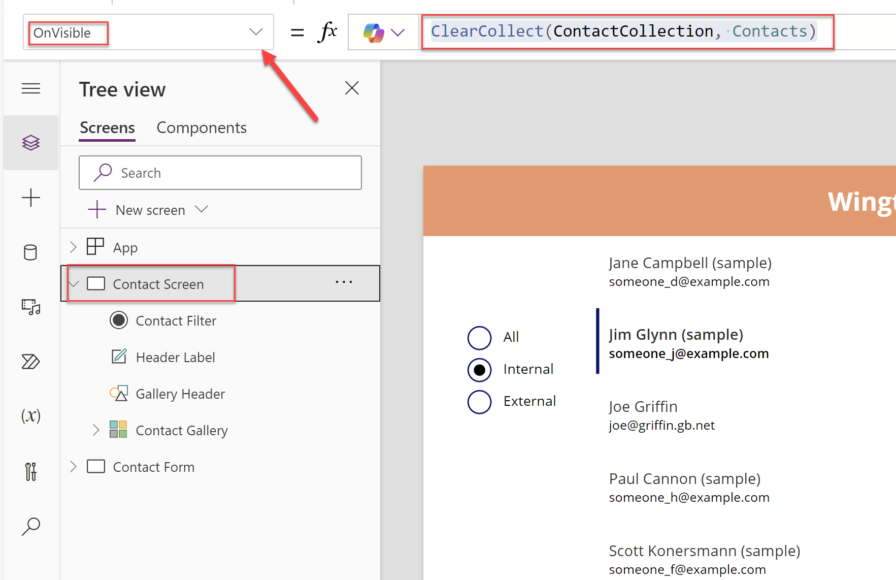

# Lab 3 - Advanced Development with Power Fx and Canvas Apps

In this lab, you will extend the canvas apps created in Lab 2 with more advanced Power Fx formulas, explore how to more effectively work with data sources in Power Apps and see how to debug a canvas app using the Monitor.

## Scenario

Having successfully created a basic canvas app that allows sales people to view Contact records, and extended the app to include a simple Power Fx formula to calculate the age of each Contact record and to display weather information relating to the Contact's location, Wingtip Toys have asked you to further enhance the app by implementing the following requirements:

- Allow for users to edit Contacts that have been selected from the **Contact Gallery**.
- Write information back to the Contact **Description** field when a Contact is updated. This field should be read-only and not editable by the user.
- Filter the existing Contact screen to only display Contacts that are external. A new field needs to be added to the Contact table, to support this requirement.

Wingtip Toys have also asked you to explore changing the existing data source of the canvas apps to a different 3rd party system. Based on your research, you have determined that this may lead to unintended side effects as a result of delegation and query limits. You therefore plan to experiment further so you can better understand the behaviours involved with delegation and the impact of using [Collections](https://learn.microsoft.com/en-us/power-apps/maker/canvas-apps/working-with-data-sources#collections). Your plan is to use the Monitor tool to assist you in this diagnosis.

## Instructions

In this lab, you will do the following:

- Extend the existing canvas app to allow the sellers to update existing Contact records in Dataverse, using the `Patch()` function.
- Add a new field to the Contact table in Dataverse to support the filtering of external Contacts.
- Implement a Power Fx formula to filter the existing Contact screen to only display Contacts that are external.
- Use the Monitor to diagnose and resolve performance issues with the app.

This lab will take approximately 30 minutes to complete.

> [!IMPORTANT]
> Ensure that all steps have been completed in Lab 2 before proceeding with this lab.

## Exercise 1: Extend the Canvas App

1. Navigate to the [Power Apps Maker Portal](https://make.powerapps.com) and, if not already selected, navigate to the developer environment you created in Lab 0:
   
    

2. Click on **Apps** from the left-hand navigation menu, and then click on the edit icon next to the `Lab 2` application created in Lab 2. You may need to hover over the app to see the edit icon:
   
    

3. After a few moments, the canvas app will open in the Power Apps Studio. Click on the **Contact Form** screen in the left-hand **Tree view** menu to open the screen:
   
    

4. Click on the **Insert** tab in the top menu, and then search for and select the **Save** icon to add the control to the screen:
   
    

5. Rename the **Save** button to **Save Contact** by double clicking it in the **Tree view** menu:
   
    

6. With the **Save Contact** icon selected and using the dropdown menu, configure the properties for the control as indicated below:

    | Property | Formula |
    | --- | --- |
    | **Height** | `140` |
    | **Width** | `124` |
    | **X** | `0` |
    | **Y** | `239` |

7. After configuring the **Save Contact** icon, the screen should resemble the below screenshot:

    

8. Configure the **DisplayMode** property of the **Save Contact** icon by using the following formula. This will ensure the icon can only be selected if a change has been made to the form:

    ```
    If(ContactForm.Unsaved = true, DisplayMode.Edit, DisplayMode.Disabled)
    ```

    

9. Configure the **OnSelect** property of the **Save Contact** icon by using the following formula. This formula will update the contact with the latest changes from the form, and add a custom description value:

    ```
    Patch(Contacts, 'Contact Gallery'.Selected, ContactForm.Updates, {Description: Concatenate("Last updated by ", User().FullName)})
    ```

    

> [!IMPORTANT]
> The `Patch()` function can be used interchangeably to either create or update records in a data source. It would also be possible to use the `SubmitForm()` function to achieve a similar resullt, but in this scenario, we want to update an additional field that is not currently part of the form. We will add this field in a read only state shortly.

10. Click on the **Contact Form** screen in the left-hand **Tree view** menu to open the screen, and then click on the **Edit fields** option in the properties pane:
   
    

11. Click on the **Add field** button, select the **Description** field from the list of fields and then click on **Add** to add it to the form. You can use the search box to find the field more easily:
   
    

12. On the list of fields, expand the **Description** field if not already expanded and change the **Control type** to **View text**: 
   
    

13. Close the fields pane by selecting the cross icon in the top right corner of the pane:
   
    

14. The screen should now resemble the below screenshot - the **Save icon** should be disabled and the **Description** data card should no longer have a text input field displayed:

    

15. Test the application by clicking on the **Play** icon in the top right corner of the screen. Make a change to any of the Contact fields and confirm that that the **Save Contact** icon is enabled. Then, click on the **Save Contact** icon. The changes should be saved and the description field should be updated with the text `Last updated by [Your Name]`. The **Save Contact** icon should also be disabled again:

    

    

> [!IMPORTANT]
> The `Patch()` function can provide additional versaility, particularly when there is a need to populate additional hidden fields based on a more complex calculation. However, for most scenarios, remember that the `SubmitForm()` function is the recommended approach for saving data in a form.
>
> In this scenario, we wrote information regarding who last modified the record to the **Description** field. However, keep in mind that Dataverse does have a built in **Modified By** field that can be used to track this information. This field is automatically updated by Dataverse when a record is modified, and may be a more appropriate choice for a production application.

16. Exit the app player by clicking on the **Close** icon in the top right corner of the screen.
17. Click on the **Save** icon to save all changes to the app.
18. Click on the **Back** button to exit the app designer. We will return to the app later in the lab.

## Exercise 2: Customize the Contact Table

> [!IMPORTANT]
> This exercise assumes that you have completed the previous exercises. Make sure you have completed all steps described above, including closing the canvas app designer.

1. Open a new browser tab and navigate to the [Power Apps Maker Portal](https://make.powerapps.com).
2. In the **Power Apps Maker Portal**, click on **Solutions** from the left-hand navigation menu:
   
    

3. We will create a solution to store all of our previous and future changes. Click on the **+ New solution** button in the top menu:
   
    

4. In the **Create a solution** pane, enter the following details and then click on the **Create** button:
    - **Display name**: `Wingtip Toys PP Solution`
    - **Name**: `WingtipToysPPSolution`
    - **Publisher**: Select **New publisher**, enter the following details and then press **Save**. Then, select the newly created publisher in the dropdown:
        - **Display name**: `Wingtip Toys`
        - **Name**: `WingtipToys`
        - **Description**: `Publisher for Wingtip Toys Power Platform solutions`
        - **Prefix**: `wtt`
        - **Choice value prefix**: `96295`
    - **Version**: `1.0.0.0`

    

    

> [!IMPORTANT]
> Before doing any development work involving Microsoft Dataverse, you should always plan to create a solution and publisher prefix. Doing so will ensure you can more easily transport your changes between different environments and so you can more easily identify your changes, based on the publisher prefix. We'll observe how this is used in the steps that follow.

5. The newly created **Wingtip Toys PP Solution** solution should open. Click on **Add existing**, then select **App** and then **Canvas app**:
   
    

6. On the **Add existing canvas apps** screen, select **Outside Dataverse** and then add the `Lab 2` app to the solution:

    

    

> [!IMPORTANT]
> If you receive a `'Lab 2' is locked by [User]` error, make sure you have closed the app. If you are still experiencing issues, try refreshing the browser.

7. The **Lab 2** app should now be added and visible in the solution:

    

8. Click on **Add existing**, then select **Automation** and then **Cloud flow**:

    

9. On the **Add existing cloud flows** screen, select **Outside Dataverse** and then add the `GetWeatherForLocation` cloud flow to the solution:

    

    

10. The `GetWeatherForLocation` cloud flow should now be added and visible in the solution, alongside a Connection Reference component for the MSN Weather connector:

    

> ![!IMPORTANT]
> Connection references are used to ensure different connection profiles can be defined for our apps and automations as we move them between different environments. For example, if our app was using a SQL Server database and we have different servers/databases for our live and testing environments, the connection reference would enable us to define these seperately. For more information on connection references, [consult the Microsoft Learn site](https://learn.microsoft.com/en-us/power-apps/maker/data-platform/create-connection-reference).

11. We will now customize the Contact table to add the new field. Click on **Add existing** again and then select **Table**:

    

12. On the **Add existing tables** screen, scroll down to select the **Contact** table and then click on **Next**:

    

13. On the **Selected tables** screen, click on **Add**. Do **NOT** tick the boxes for **Include all objects** or **Include table metadata**:

    

> [!IMPORTANT]
> The **Include all objects** and **Include table metadata** options are used to include all fields and metadata for the table. In this scenario, to avoid solution "bloat" and because we are customizing a table that forms part of the Common Data Model, adding in the entire table could cause issues with deploying it out in future.

14. The **Contact** table should now be added and visible in the solution:

    

15. On the **Objects** list, expand **Tables**, then **Contact** and then click on **Columns**:

    

16. On the **Columns** view, click on **+ New column**:

    

17. In the **New column** pane, enter the following details and then click on **Save**:

- **Display name**: `External Contact?`
- **Description**: `Indicates the type of Contact`
- **Data type**: Select `Choice` -> `Choice`
- **Sync with global choice?**: Select `No`
    - **Choices**: Add the following choices:
        - First Choice:
            - **Label**: `Internal`
            - **Value**: `962950000`
        - Second Choice:
            - **Label**: `External`
            - **Value**: `962950001`
- **Default choice**: Select `None`
- **Schema name**: `wtt_contacttype`

    

    

> [!IMPORTANT]
> You may need to expand the **Advanced options** heading to view all configuration properties.

18. The new column should now be visible in the **Columns** view:

    

19. Click on **All** to return an overview of the solution:

    

19. Leave the solution view and maker portal open, as we will continue from here in the next exercise.

## Exercise 3: Add External Contact and Filter to the Canvas App

> [!IMPORTANT]
> Ensure that all steps in Exercise 2 have been completed before proceeding.

1. You should still be in the solution view for the **Wingtip Toys PP Solution** created in the previous exercise; if not, navigate there now.
2. Click on the `Lab 2` canvas app to open it in the designer:

    

3. In the **Tree view**, expand the **Contact Form** screen and then select the **ContactForm** control:

    

4. In the properties pane, click on **8 selected** next to the **Fields** label:

    

5. In the **Fields** pane, click on **Add field** and then select the **External Contact?** field from the list of fields. You can use the search box to more easily locate it. Once selected, click on **Add** to add the field to the form:

    

6. Click on the cross icon to close the **Fields** pane. The **External Contact?** field should now be visible in the form, as a dropdown control:

    

    

7. Click on the **Contact Screen** screen in the **Tree view** and then play the application:

    

8. Navigate into the first Contact record and then populate the **External Contact?** field with the value `External`. Save the record and then navigate back to the Contact screen:

    

    

9. Repeat step 8 for all remaining Contacts in the gallery. For each Contact, alternate between the `Internal` and `External` values for the **External Contact?** field, ensuring an even split between the two values:
10. Exit the app player by clicking on the **Close** icon in the top right corner of the screen.

    

11. Select the **Contact Gallery** gallery in the **Tree view**:

    

12. Adjust the properties of the gallery as indicated in the table below. The gallery should resemble the screenshot below if configured correctly:

    | Property | Formula |
    | --- | --- |
    | **Width** | `1150` |
    | **X** | `216` |

    

13. Click on the **+ Insert** button in the top menu, and then select **Radio**. You may need to expand the **Input** heading to locate the control:

    

14. Rename the **Radio** control to **Contact Filter** by double clicking it in the **Tree view** menu:

    

13. Adjust the properties of the **Contact Filter** control as indicated in the table below. The screen should resemble the screenshot below if configured correctly:

    | Property | Formula |
    | --- | --- |
    | **Height** | `154` |
    | **Items** | `["All", "Internal", "External"]` |
    | **Width** | `160` |
    | **X** | `40` |
    | **Y** | `185` |

    

14. Select the **Contact Gallery** control and adjust the **Items** property to filter the gallery based on the selected value in the **Contact Filter** control. Use the following formula:

    ```
    Switch('Contact Filter'.SelectedText.Value, 
        "All", Contacts,
        "Internal", Filter(Contacts, 'External Contact?' = 'External Contact? (Contacts)'.Internal),
        "External", Filter(Contacts, 'External Contact?' = 'External Contact? (Contacts)'.External)
    )
    ```

    

15. Press the **Play** icon in the top right corner of the screen to test the application. Select the different options from the **Contact Filter** control and confirm that the list of Contacts in the gallery updates accordingly. Close the player when you are finished testing:

    

    

16. Currently, the gallery is returning the data in an inconsistent order. Adjust the formula for the **Items** property on the **Contact Gallery** to include the `Sort()` function. Use the following formula:

    ```
    Switch('Contact Filter'.SelectedText.Value, 
        "All", Sort(Contacts, 'Full Name', SortOrder.Ascending),
        "Internal", Sort(Filter(Contacts, 'External Contact?' = 'External Contact? (Contacts)'.Internal), 'Full Name', SortOrder.Ascending),
        "External", Sort(Filter(Contacts, 'External Contact?' = 'External Contact? (Contacts)'.External), 'Full Name', SortOrder.Ascending)
    )
    ```

    

17. Press the **Play** icon in the top right corner of the screen to test the application. Select the different options from the **Contact Filter** control and confirm that the list of Contacts is now sorted in ascending order. Close the player when you are finished testing:

    

18. Click on the **Save** icon to save all changes to the app.
19. Click on the **Back** button to exit the app designer.

## Exercise 4: Diagnosing and Resolving Performance Issues

As your app is deployed and used over time, peformance issues may arise. For these scenarios, the [Monitor tool](https://learn.microsoft.com/en-us/power-apps/maker/monitor-overview) provides us with the capability to perform a "deep view" into our app, thereby allowing us to understand all the key activities that occur. From there, bottlenecks can be identified and resolved.

For this exercise, we are going to first import some additional Contact data into our Dataverse environment. This will allow us to simulate a scenario where [delegation and query limits](https://learn.microsoft.com/en-us/power-apps/maker/canvas-apps/delegation-overview) will occur. We will see how this behaviour affects our app at runtime. Next, we will use the Monitor tool to understand how the current structure of the app may be causing performance issues, what we can do to resolve this and the potential side-effects of our actions.

1. Download the [ContactData.csv](/PowerFxFromNoviceToNinja/Resources/Lab3-AdvancedPowerFxDevelopmentInCanvasApps/Contacts.csv) file to your local machine.
2. Open a new browser tab and navigate to the [Power Apps Maker Portal](https://make.powerapps.com).
3. In the **Power Apps Maker Portal**, click on **Tables** from the left-hand navigation menu and then click on **Import** -> **Import Data**:

    

4. In the **Choose data source** page, drag and drop or browse and select the **ContactData.csv** file you downloaded in step 1. Once selected, click on **Next**:

    

5. On the **Connect to data source** page, click on **Sign in**. If prompted, sign in with your work or school account. Once you've signed in, click on **Next**:

    

    

6. On the **Preview file data** screen, review the data that will be imported and then click on **Next**:

    

7. On the Power Query editor page, click on the icon next to **birthdate** and change the data type to **Date**. If prompted with a **Change column type** dialog, click on **Add new step**. Once done, click on **Next**:

    

    

    

8. On the **Map tables** page, populate the details as follows and then select **Next**:
    - **Load settings**: Select **Load to existing table**
    - **Destination table**: Select **Contact**
    - **Column mapping**: Map the **Source column**'s and **Destination column**'s as indicated below:
        - birthdate -> BirthDate
        - emailaddress1 -> EMailAddress1
        - firstname -> FirstName
        - lastname -> LastName

    

    

    

9. On the **Refresh settings** page, ensure the **Refresh manually** option is selected and then click on **Publish**:

    

10. You will be taken back to the Maker portal. Click on **More** and then select **Dataflows**:

    

11. On the **Dataflows** page, you will see a single dataflow, which will display **In progress** under the **Next refresh** heading. Wait a few minutes, refresh the page and confirm that the refresh has completed successfully:

    

    

12. Navigate to the **Wingtip Toys PP Solution** solution and then click on the `Lab 2` canvas app to open it in the designer:

    

    

13. With the **Contact Screen** selected, click on the **Play** icon in the top right corner of the screen to test the application. With the **All** option selected, you should see the new Contact records in the gallery:

    

Now that we have imported additional data into our Dataverse environment, we can simulate a scenario involving delegation. By default, the `Filter()` and `Sort()` function support delegation when connecting to Dataverse, which means that all records will be returned from the data source. This is because the connector can apply the appropriate filtering and sorting rules at the API level.

However, there are scenarios where delegation is not supported, even with the Dataverse connector. In these scenarios, by default, only the first 500 records will be returned from the data source. Let's adjust the app to reduce the number of records returned from the data source when queries can't be delegated, and then adjust the gallery formula so that delegation is no longer supported.

1. In the app designer view, click on the **Settings** icon in the bottom left of the screen:

    

2. On the **General** tab, scroll down, change the **Data row limit** value to `5` and click on **Close**:

    

3. Back on the **Contact Screen**, observe that the gallery is still displaying all records from the Contact table. Click on the **Play** icon in the top right corner of the screen to test the application. With the **Internal** option selected, you should see at least 7 records:

    

4. Adjust the formula of the **Items** property on the **Contact Gallery** control to introduce a scenario where delegation will no longer be supported:
    
    ```
    Switch('Contact Filter'.SelectedText.Value, 
        "All", Sort(Contacts, 'Full Name', SortOrder.Ascending),
        "Internal", Sort(Filter(Contacts, 'External Contact?' = 'External Contact? (Contacts)'.Internal), 'Full Name', SortOrder.Ascending),
        "External", Sort(Filter(Contacts, 'External Contact?' = 'External Contact? (Contacts)'.External), 'Full Name', SortOrder.Ascending)
    )
    ```
    
    

5. Notice now that the gallery control has a warning icon displayed and when you press **Play** to test the application, only 2 internal Contact records are now returned. Because we adjusted the delegation settings of the application, we can more clearly see how delegation issues can impact our application:

    

> [!IMPORTANT]
> For other Dataverse data types, `IsBlank()` is usually delegable. Choice columns are the only type that are not supported. For more information on what is and isn't supported for delegation with the Dataverse connector, [consult the Microsoft Learn site](https://learn.microsoft.com/en-us/power-apps/maker/canvas-apps/connections/connection-common-data-service#power-apps-delegable-functions-and-operations-for-dataverse).

6. Fix the delegation issue by reverting the formula in the gallery **Items** property:

    ```
    Switch('Contact Filter'.SelectedText.Value, 
        "All", Sort(Contacts, 'Full Name', SortOrder.Ascending),
        "Internal", Sort(Filter(Contacts, 'External Contact?' = 'External Contact? (Contacts)'.Internal), 'Full Name', SortOrder.Ascending),
        "External", Sort(Filter(Contacts, 'External Contact?' = 'External Contact? (Contacts)'.External), 'Full Name', SortOrder.Ascending)
    )
    ```
7. Notice that the delegation warnings disappear and the expected number of Contact records are returned again.

This part of the exercise is designed to make you aware of the practical implications of delegation and how it can impact your app, especially in relation to what data is returned for an end user. The Dataverse connector, along with the [SQL Server](https://learn.microsoft.com/en-us/connectors/sql/#power-apps-functions-and-operations-delegable-to-sql-server), [SharePoint](https://learn.microsoft.com/en-us/connectors/sharepointonline/#power-apps-delegable-functions-and-operations-for-sharepoint) and [Salesforce](https://learn.microsoft.com/en-us/connectors/salesforce/#power-apps-delegable-functions-and-operations-for-salesforce) connectors support the widest range of delegation options, but other data sources may vary. You should always ensure you check the documentation for any connector you use in your app, to understand what is and isn't supported with delegation.

Let's move onto the final part of the exercise, where we will use the Monitor tool to inspect our apps performance and implement some changes to improve it:

1. In the `Lab 2` app designer, click on **Advanced tools** and then the **Open monitor** label to open the Monitor:

    

2. The Monitor tool will open in a new browser tab. You should see a label that reads **Studio session**. This indicates that any action taken within the app designer will be logged to this monitor session:

    

3. Navigate back to the app designer tab and click on the **Play** icon to test the application. Spend a few moments on the **Contact Screen** doing the following:
    - With the **All** filter selected, scrolling down the gallery page until the contact names start to begin with the letter **H**.
    - Applying the **Internal** and **External** filters
    - Selecting a Contact record, updating it's information and then saving the record.
4. Return to the browser tab with the Monitor tool open. You should see a list of all the actions you performed in the app. In addition, you will see multiple requests to the **Contact** data source:

    

Because of how we have created the app in the previous lab steps, the app is making multiple requests to the data source to retrieve the same data. This could lead to performance issues over time. We could resolve this by using the `ClearCollect()` function to store the data in a collection, and then reference the collection in the gallery. This will reduce the amount of outbound network calls made into Dataverse and ensure the app is as performant as possible. However, we will also observe a side effect of this change relating to delegation:

5. Return to the app designer tab, exit the **Play** mode and click on the **Contact Screen** screen in the **Tree view**. Change the **OnVisible** property of the screen to the following formula:

    ```
    ClearCollect(ContactCollection, Contacts)
    ```

    

7. Click on the **Contact Form** screen in the **Tree View** and then the **Contact Screen** again. This should force the **OnVisible** property to run and populate the collection with the Contact data. You can verify this by clicking the **Variables** tab and verifying that the Collection exsits:

    

6. Adjust the formula as part of the **Items** property in the **Contact Gallery** to use the new collection:

    ```
    Switch('Contact Filter'.SelectedText.Value, 
        "All", Sort(ContactCollection, 'Full Name', SortOrder.Ascending),
        "Internal", Sort(Filter(ContactCollection, 'External Contact?' = 'External Contact? (Contacts)'.Internal), 'Full Name', SortOrder.Ascending),
        "External", Sort(Filter(ContactCollection, 'External Contact?' = 'External Contact? (Contacts)'.External), 'Full Name', SortOrder.Ascending)
    )
    ```
    

7. Observe that with the new formula and with the **All** filter selected, only five records are displayed:

    

8. Navigate back to the browser tab with the Monitor tool open and press the **Clear data** button to clear the current session:

    

9. Return to the app designer tab and click on the **Play** icon to test the application. Spend a few moments repeating the same action steps as described in step 3, with the exception of modifying a Contact record. Once done, return to the Monitor tool tab.
10. Observe that there are no new requests to the **Contact** data source. This is because the data is now stored in the collection and the app is referencing the collection instead of making multiple requests to the data source:

    

Although collections can be a powerful way to reduce the amount of network traffic in your applications, issues can arise due to delegation. Because we previously modified the **Data row limit** property to `5`, this will now be the maximum number of records that `ClearCollect()` will return for us. We can work around this by increasing this limit to `1100`, but this is not a fail-safe solution. In addition, this property only supports a maximum value of `2000`:


The purpose of this final exercise is to make you aware of the practical implications of your design choices. You will need to ask yourself the following questions to determine the best approach for your app:

- What is the maximum potential size of my data source or result set when using `Filter()` or similar? If this is in excess of 2000 records, you may need to consider alternative approaches.
- Does the data source I'm using support delegation? If not, how can I work around this?
- What is the expected number of network calls my app will make to my data source and how could this be negatively impacting performance? For example, usage of the `Lookup()` or `ForAll()` function in conjunction with these could introduce significant performance issues.

> [!IMPORTANT]
> Before finishing up this lab exercise and saving your changes for the final time, make sure you revert back the formula used for the **Items** property in the **Contact Gallery**:
    
```
Switch('Contact Filter'.SelectedText.Value, 
    "All", Sort(Contacts, 'Full Name', SortOrder.Ascending),
    "Internal", Sort(Filter(Contacts, 'External Contact?' = 'External Contact? (Contacts)'.Internal), 'Full Name', SortOrder.Ascending),
    "External", Sort(Filter(Contacts, 'External Contact?' = 'External Contact? (Contacts)'.External), 'Full Name', SortOrder.Ascending)
)
```

**Congratulations, you've finished Lab 3** 🥳