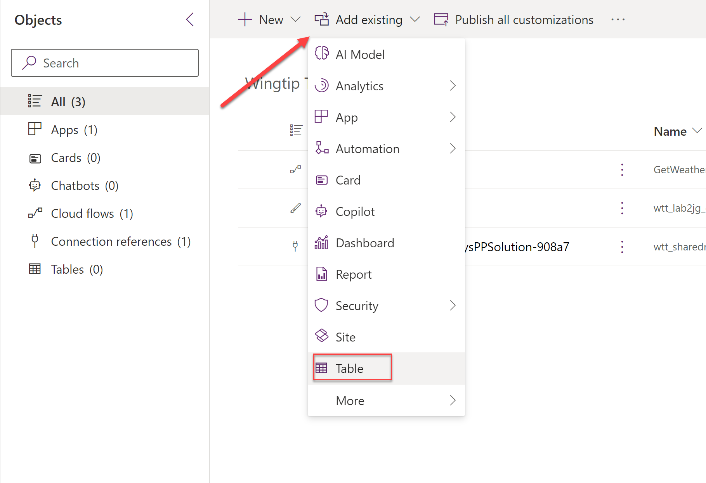

# Lab 3 - Advanced Development with Power Fx and Canvas Apps

In this lab, you will extend the canvas apps created in Lab 2 with more advanced Power Fx formulas, explore how to more effectively work with data sources in Power Apps and see how to debug a canvas app using the Monitor.

## Scenario

Having successfully created a basic canvas app that allows sales people to view Contact records, and extended the app to include a simple Power Fx formula to calculate the age of each Contact record and to display weather information relating to the Contact's location, Wingtip Toys have asked you to further enhance the app by implementing the following requirements:

- Allow for users to edit Contacts that have been selected from the **Contact Gallery**.
- Write information back to the Contact **Description** field when a Contact is updated. This field should be read-only and not editable by the user.
- Filter the existing Contact screen to only display Contacts that are external. A new field needs to be added to the Contact table, to support this requirement.

You also need to diagnose some issues with the initial version of the app that was launched to the sellers. Sellers have reported that the app is slow to load and that some of the data is not displaying correctly. You plan to use the Monitor to diagnose these issues further.

## Instructions

In this lab, you will do the following:

- Extend the existing canvas app to allow the sellers to update existing Contact records in Dataverse, using the `Patch()` function.
- Add a new field to the Contact table in Dataverse to support the filtering of external Contacts.
- Implement a Power Fx formula to filter the existing Contact screen to only display Contacts that are external.
- Use the Monitor to diagnose and resolve performance issues with the app.

This lab will take approximately 30 minutes to complete.

> [!IMPORTANT]
> Ensure that all steps have been completed in Lab 2 before proceeding with this lab.

## Exercise 1: Extend the Canvas App

1. Navigate to the [Power Apps Maker Portal](https://make.powerapps.com) and, if not already selected, navigate to the developer environment you created in Lab 0:
   
    

2. Click on **Apps** from the left-hand navigation menu, and then click on the edit icon next to the `Lab 2` application created in Lab 2. You may need to hover over the app to see the edit icon:
   
    

3. After a few moments, the canvas app will open in the Power Apps Studio. Click on the **Contact Form** screen in the left-hand **Tree view** menu to open the screen:
   
    

4. Click on the **Insert** tab in the top menu, and then search for and select the **Save** icon to add the control to the screen:
   
    

5. Rename the **Save** button to **Save Contact** by double clicking it in the **Tree view** menu:
   
    

6. With the **Save Contact** icon selected and using the dropdown menu, configure the properties for the control as indicated below:

    | Property | Formula |
    | --- | --- |
    | **Height** | `140` |
    | **Width** | `124` |
    | **X** | `0` |
    | **Y** | `239` |

7. After configuring the **Save Contact** icon, the screen should resemble the below screenshot:

    

8. Configure the **DisplayMode** property of the **Save Contact** icon by using the following formula. This will ensure the icon can only be selected if a change has been made to the form:

    ```
    If(ContactForm.Unsaved = true, DisplayMode.Edit, DisplayMode.Disabled)
    ```

    

9. Configure the **OnSelect** property of the **Save Contact** icon by using the following formula. This formula will update the contact with the latest changes from the form, and add a custom description value:

    ```
    Patch(Contacts, 'Contact Gallery'.Selected, ContactForm.Updates, {Description: Concatenate("Last updated by ", User().FullName)})
    ```

    

> [!IMPORTANT]
> The `Patch()` function can be used interchangeably to either create or update records in a data source. It would also be possible to use the `SubmitForm()` function to achieve a similar resullt, but in this scenario, we want to update an additional field that is not currently part of the form. We will add this field in a read only state shortly.

10. Click on the **Contact Form** screen in the left-hand **Tree view** menu to open the screen, and then click on the **Edit fields** option in the properties pane:
   
    

11. Click on the **Add field** button, select the **Description** field from the list of fields and then click on **Add** to add it to the form. You can use the search box to find the field more easily:
   
    

12. On the list of fields, expand the **Description** field if not already expanded and change the **Control type** to **View text**: 
   
    

13. Close the fields pane by selecting the cross icon in the top right corner of the pane:
   
    

14. The screen should now resemble the below screenshot - the **Save icon** should be disabled and the **Description** data card should no longer have a text input field displayed:

    

15. Test the application by clicking on the **Play** icon in the top right corner of the screen. Make a change to any of the Contact fields and confirm that that the **Save Contact** icon is enabled. Then, click on the **Save Contact** icon. The changes should be saved and the description field should be updated with the text `Last updated by [Your Name]`. The **Save Contact** icon should also be disabled again:

    

    

> [!IMPORTANT]
> The `Patch()` function can provide additional versaility, particularly when there is a need to populate additional hidden fields based on a more complex calculation. However, for most scenarios, remember that the `SubmitForm()` function is the recommended approach for saving data in a form.
>
> In this scenario, we wrote information regarding who last modified the record to the **Description** field. However, keep in mind that Dataverse does have a built in **Modified By** field that can be used to track this information. This field is automatically updated by Dataverse when a record is modified, and may be a more appropriate choice for a production application.

16. Exit the app player by clicking on the **Close** icon in the top right corner of the screen.
17. Click on the **Save** icon to save all changes to the app.
18. Click on the **Back** button to exit the app designer. We will return to the app later in the lab.

## Exercise 2: Customize the Contact Table

> [!IMPORTANT]
> This exercise assumes that you have completed the previous exercises. Make sure you have completed all steps described above, including closing the canvas app designer.

1. Open a new browser tab and navigate to the [Power Apps Maker Portal](https://make.powerapps.com).
2. In the **Power Apps Maker Portal**, click on **Solutions** from the left-hand navigation menu:
   
    

3. We will create a solution to store all of our previous and future changes. Click on the **+ New solution** button in the top menu:
   
    

4. In the **Create a solution** pane, enter the following details and then click on the **Create** button:
    - **Display name**: `Wingtip Toys PP Solution`
    - **Name**: `WingtipToysPPSolution`
    - **Publisher**: Select **New publisher**, enter the following details and then press **Save**. Then, select the newly created publisher in the dropdown:
        - **Display name**: `Wingtip Toys`
        - **Name**: `WingtipToys`
        - **Description**: `Publisher for Wingtip Toys Power Platform solutions`
        - **Prefix**: `wtt`
        - **Choice value prefix**: `96295`
    - **Version**: `1.0.0.0`

    

    

> [!IMPORTANT]
> Before doing any development work involving Microsoft Dataverse, you should always plan to create a solution and publisher prefix. Doing so will ensure you can more easily transport your changes between different environments and so you can more easily identify your changes, based on the publisher prefix. We'll observe how this is used in the steps that follow.

5. The newly created **Wingtip Toys PP Solution** solution should open. Click on **Add existing**, then select **App** and then **Canvas app**:
   
    

6. On the **Add existing canvas apps** screen, select **Outside Dataverse** and then add the `Lab 2` app to the solution:

    

    

> [!IMPORTANT]
> If you receive a `'Lab 2' is locked by [User]` error, make sure you have closed the app. If you are still experiencing issues, try refreshing the browser.

7. The **Lab 2** app should now be added and visible in the solution:

    

8. Click on **Add existing**, then select **Automation** and then **Cloud flow**:

    

9. On the **Add existing cloud flows** screen, select **Outside Dataverse** and then add the `GetWeatherForLocation` cloud flow to the solution:

    

    

10. The `GetWeatherForLocation` cloud flow should now be added and visible in the solution, alongside a Connection Reference component for the MSN Weather connector:

    

> ![!IMPORTANT]
> Connection references are used to ensure different connection profiles can be defined for our apps and automations as we move them between different environments. For example, if our app was using a SQL Server database and we have different servers/databases for our live and testing environments, the connection reference would enable us to define these seperately. For more information on connection references, [consult the Microsoft Learn site](https://learn.microsoft.com/en-us/power-apps/maker/data-platform/create-connection-reference).

11. We will now customize the Contact table to add the new field. Click on **Add existing** again and then select **Table**:

    

12. On the **Add existing tables** screen, scroll down to select the **Contact** table and then click on **Next**:

    

13. On the **Selected tables** screen, click on **Add**. Do **NOT** tick the boxes for **Include all objects** or **Include table metadata**:

    

> [!IMPORTANT]
> The **Include all objects** and **Include table metadata** options are used to include all fields and metadata for the table. In this scenario, to avoid solution "bloat" and because we are customizing a table that forms part of the Common Data Model, adding in the entire table could cause issues with deploying it out in future.

14. The **Contact** table should now be added and visible in the solution:

    

15. On the **Objects** list, expand **Tables**, then **Contact** and then click on **Columns**:

    

16. On the **Columns** view, click on **+ New column**:

    

17. In the **New column** pane, enter the following details and then click on **Save**:

- **Display name**: `External Contact?`
- **Description**: `Indicates the type of Contact`
- **Data type**: Select `Choice` -> `Choice`
- **Sync with global choice?**: Select `No`
    - **Choices**: Add the following choices:
        - First Choice:
            - **Label**: `Internal`
            - **Value**: `962950000`
        - Second Choice:
            - **Label**: `External`
            - **Value**: `962950001`
- **Default choice**: Select `None`
- **Schema name**: `wtt_contacttype`

    

    

> [!IMPORTANT]
> You may need to expand the **Advanced options** heading to view all configuration properties.

18. The new column should now be visible in the **Columns** view:

    

19. Leave the solution view and maker portal open, as we will need it in the next exercise.

## Exercise 3: Add External Contact and Filter to the Canvas App

## Exercise 4: Use the Monitor to Diagnose Performance Issues