# Lab 4 - Extending Microsoft Dataverse with Power Fx

In this lab, you will implement customizations in Dataverse using Power Fx in modern commanding, formula columns and low-code plug-ins. Finally, you will take the canvas app created in Lab 2 and 3 and embed this into a model-driven Power App.

## Scenario

It has been three months since WingTip Toys have deployed out the canvas app developed for the sellers in Lab 2 and 3. Due to the success of the initial rollout, additional budget has been allocated to extend out the organisations Power Platform environment, and to introduce a new application for the account management team, which will enable them to better manage all of WingTip Toys customers. After a meeting with the account management team, the following requirements have been identified:

- The account management team would like to have a desktop based application that allows them to manage Contacts from their web browsers.
- It is a requirement that all new Accounts in the system are populated with default information in the following key fields. Sellers frequently forget to provide these details, meaning that the account management team have to enter them manually. They have asked if this time consuming task could be automated via a single button press.
    - **Credit Limit**
    - **Payment Terms**
    - **Freight Terms**
- The account management team were impressed with the age calculation based on a Contacts birthday in the canvas app, and would like the same replicated and persisted in their new application.
- The account management team frequently encounter issues with the telephone numbers provided by the sellers in the field, which causes issues with their click-to-dial solution. They would like a mechanism automatically validate and format the telephone numbers when they are entered into the system to align to the US standard format of **(NPA) NXX-XXXX**.
- To assist the account management team in working with all Contacts for an Account, they would like a mechanism to list and then update related Contact records from the Account form. The account management team are expecting a similar user interface to the canvas app.

Based on the requirements, you have determined that a [model-driven Power App](https://learn.microsoft.com/en-us/power-apps/maker/model-driven-apps/model-driven-app-overview) will be the best solution for the account management and, using the additional capabilities available as part of Power Fx in Dataverse, you plan to leverage the following features to meet the requirements:

- [Modern commanding using Power Fx](https://learn.microsoft.com/en-us/power-apps/maker/model-driven-apps/commanding-use-powerfx)
- [Formula columns](https://learn.microsoft.com/en-us/power-apps/maker/data-platform/formula-columns?tabs=type-or-paste)
- [Low-code plug-ins](https://learn.microsoft.com/en-us/power-apps/maker/data-platform/low-code-plug-ins?tabs=instant)
- [Embedding a canvas app into a model-driven app](https://learn.microsoft.com/en-us/power-apps/maker/model-driven-apps/embedded-canvas-app-add-classic-designer)

## Instructions

In this lab, you will do the following:

- Create a simple model-driven app
- Implement a custom command in Dataverse using Power Fx
- Create a formula column for the Contact table
- Implement a low-code plug-in that will validate and format a Contact's telephone number
- Embed the canvas app created in Lab 2 and 3 into the model-driven app

This lab will take approximately 45 minutes to complete.

> [!IMPORTANT]
> Ensure that all steps have been completed in Lab 3 before proceeding with this lab.

## Exercise 1: Create a Model-Driven App

1. Navigate to the [Power Apps Maker Portal](https://make.powerapps.com) and, if not already selected, navigate to the developer environment you created in Lab 0:
   
    

2. Click on **Solutions** in the left-hand navigation pane and then click on the **Wingtip Toys PP Solution** solution you created in Lab 3:
   
    

3. Click on **+ New** and then select  **App** -> **Model-driven app**:

    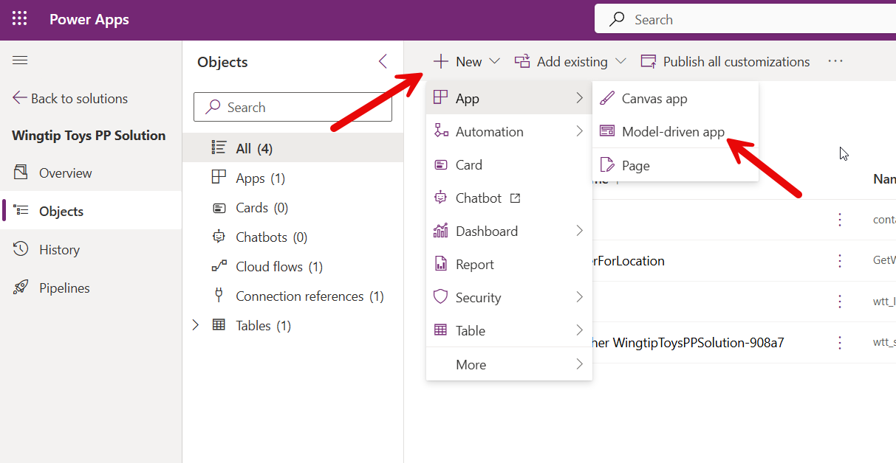

4. In the **New model-driven app** dialog, enter the following details and then select **Create**:
    - **Name**: `Wingtip Toys Account Management`
    - **Description**: `A model-driven app for the account management team to manage Accounts and Contacts`

    

5. Once created, you will be presented with the model-driven app designer, which should resemble the screenshot below:

    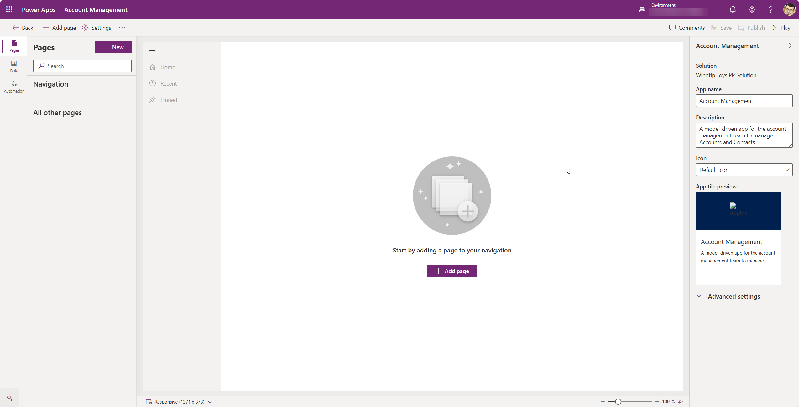

6. We can now proceed to add the required tables to our solution. Click on **+ New** next to the **Pages** heading and select **Dataverse table**:

    

7. In the **Select a table** dialog, search for and select the following tables. ensuring that the **Show in navigation** tickbox is checked. Then, press **Add**:
    - **Account**
    - **Contact**

    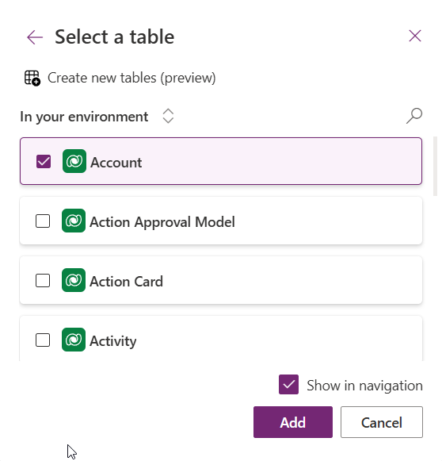

    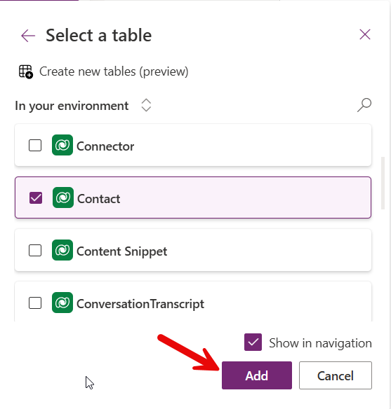

8. Once added, you should see the tables appear in the left-hand navigation pane underneath the **Navigation** heading and the designer view should provide a preview of how the app looks:

    

> [!IMPORTANT]
> If you see a message in the preview saying `An error has occurred. Please try again later. If the problem persists, contact your system administrator.`, refresh your browser window to rectify it.

9. Click on the **New Group** group in the **Navigation** area and then, on the properties pane to the right side of the screen, change the **Title** to `Customers`:

    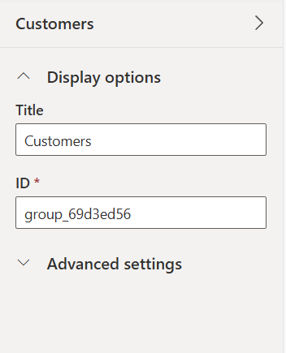

10. Save your changes by clicking on the **Save** button in the top right-hand corner of the screen:

    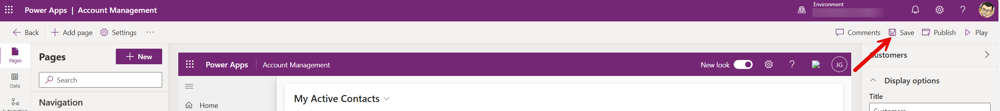

11. Publish the newly created app by clicking on the **Publish** button. The app may take a few minutes to publish:

    

12. Once published, click on the **Play** button to open the app in a new tab:

    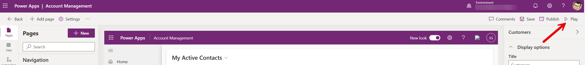

> [!IMPORTANT]
> You may be prompted to sign-in again.

13. You should now see the model-driven app you created, with the Account and Contact tables available in the navigation pane. By default, the app will display the **Accounts** table and the **My Active Accounts** view:

    

14. Click on any Account record in the **My Active Accounts** view to open the Account form:

    

    

15. The Account form will display for the selected record. Observe the following regarding the form:
    - The form, similar to the view, has a ribbon bar with a series of different options, such as **Save**, **Delete**, **Run Workflow**, etc. Unlike a canvas app, most common data operations are already available for us in the ribbon and we don't have to define this logic ourselves. We can also extend out the ribbon bar for forms and views with our own custom commands, which we will do in the next exercise.

    

    - On the form, we can see the **Phone** field has already been added. This field will be targeted as part of the low-code plug-in we will implement in Exercise 4.

    

    - The form currently has three tabs displayed - **Summary**, **Details** and **Related**. We can add additional tabs and sections to the form to display further information or to group information together. In Exercise 5, we will add a new tab to this form to display the canvas app we created in Lab 2 and 3.

16. Press the **Back** button to return back to the **My Active Accounts** view:

    

17. Continue to experiment with the newly created application by opening further records, making changes and also doing the same with the **Contacts** table. Observe how the experience of working with different tables is similar, providing a streamlined experience for our app users. When you are finished exploring, close the browser tab to return to the model-driven app designer window.

18. Leave the model-driven app designer open as we will be starting from here in the next exercise.

## Exercise 2: Implement a Custom Command in Dataverse using Power Fx

> [!IMPORTANT]
> This exercise assumes that you have completed the previous exercise and that you still have the model-driven app designer open for the **Account Management** app. If you are not there, proceed there now.

1. In the model-driven app designer, under the **Navigation** heading, click on the elipses (...) next to the **Accounts** table and then select **Edit command bar** -> **Edit in new tab**:

    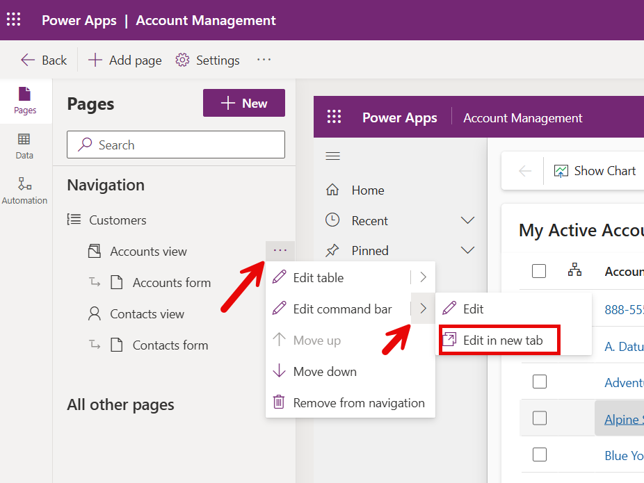

2. A new browser tab will open. In the **Edit command bar for Accounts** dialog, select the **Main form** option and then click on **Edit**:

    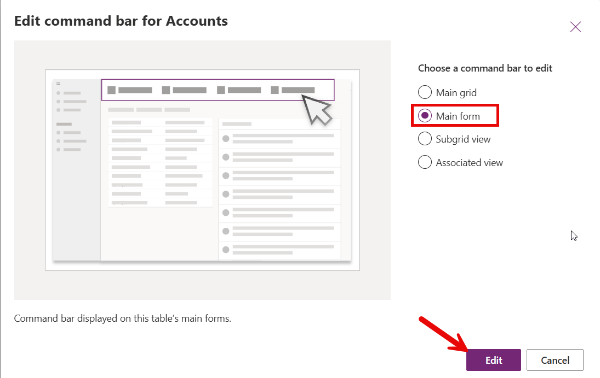

3. The command designer for the Account Main Form will open. Select the **Create component library to enable Power Fx** label in the ribbon and then select **Continue** to create a component library for your ribbon formulas. This may take several minutes:

    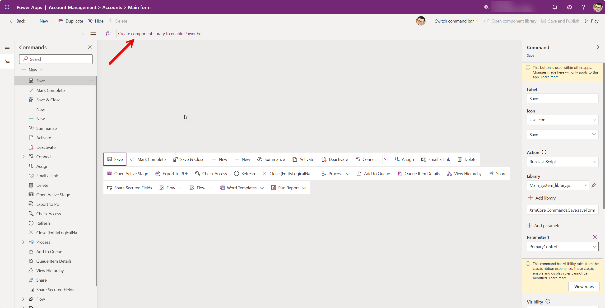

    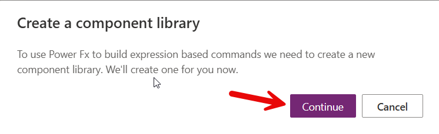

> [!IMPORTANT]
> If this message does not display and the formula bar is editable, then the component library is already enabled. You can skip to step 4.

4. Underneath the **Commands** heading, select **+ New** and then **Command**:

    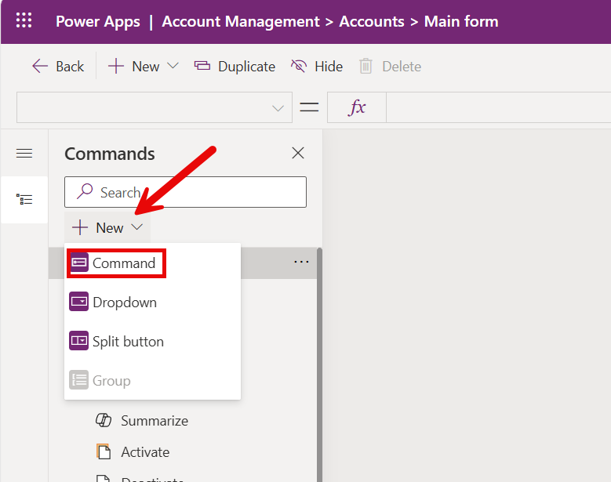

5. The **NewCommand** will be added to the ribbon. Drag and drop the **NewCommand** command so that it is positioned directly before the **Activate** command:

    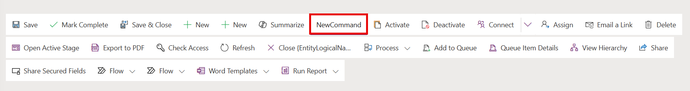

6. With the **NewCommand** command selected, modify it's properties on the right-hand of the screen as follows:
    - **Label**: `Populate Defaults`
    - **Icon**: Select **Use Icon** and then type and select the **CheckboxComposite** option in the second dropdown.
    - **Tooltip title**: `Populate Default Information`
    - **Tooltip description**: `Add missing information to the Account record`

    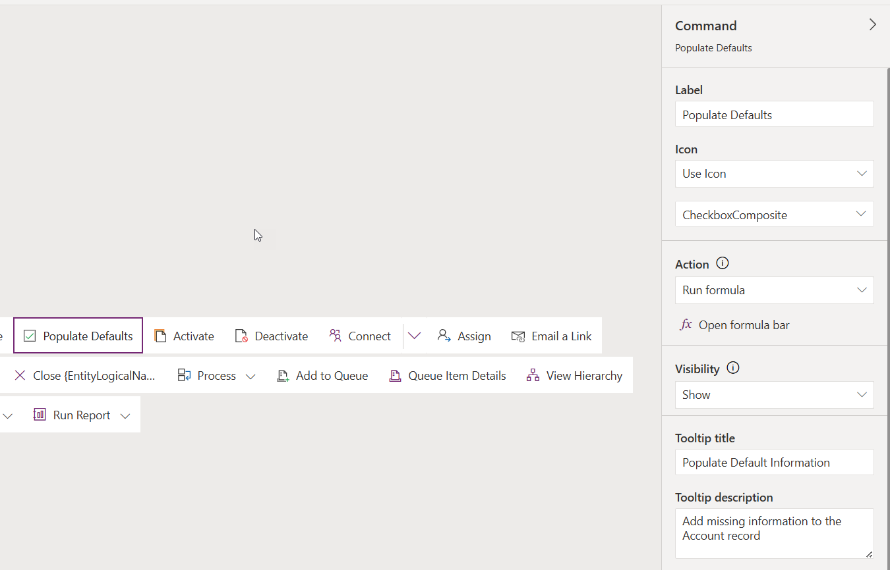

7. With the **Populate Defaults** command selected in the designer, under **Action**, ensure that the **Run formula** option is selected and then click on **Open formula bar**:

    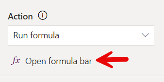

8. In the formula bar, enter the following formula. The formula will add default information to the **Credit Limit**, **Payment Terms** and **Freight Terms** fields if they have been left empty by the sellers, and then display a notification to the end user. In addition, the formula does checks to confirm that existing values are not overwritten:

    ```
    Patch(
        Accounts,
        Self.Selected.Item,
        {
            'Credit Limit' : If(IsBlank(Self.Selected.Item.'Credit Limit') || Self.Selected.Item.'Credit Limit' <> Self.Selected.Item.'Credit Limit', 1000, Self.Selected.Item.'Credit Limit'),
            'Payment Terms': If(IsBlank(Self.Selected.Item.'Payment Terms') || Self.Selected.Item.'Payment Terms' <> Self.Selected.Item.'Payment Terms', 'Payment Terms (Accounts)'.'Net 30', Self.Selected.Item.'Payment Terms'),
            'Address 1: Freight Terms': If(IsBlank(Self.Selected.Item.'Address 1: Freight Terms') || Self.Selected.Item.'Address 1: Freight Terms' <> Self.Selected.Item.'Address 1: Freight Terms', 'Address 1: Freight Terms (Accounts)'.'No Charge', Self.Selected.Item.'Address 1: Freight Terms')
        }
    );
    Notify("Default values populated successfully!")
    ```

    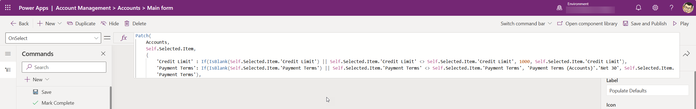

9. On the properties pane for the **Populate Defaults** command, change the dropdown value of **Visibility** to **Show on condition from formula**, and then select **Open formula bar**:

    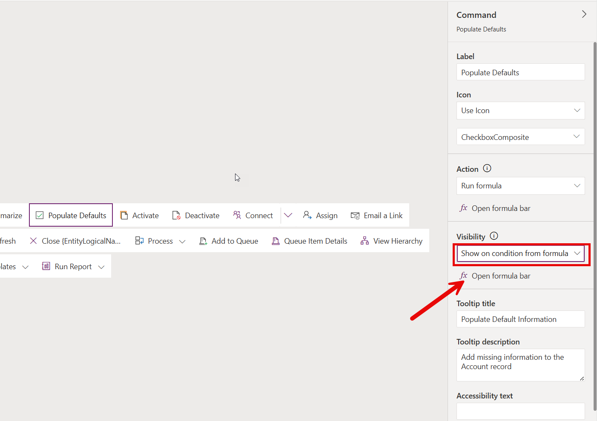

10. In the formula bar, enter the following formula which will only show the command if the **Credit Limit**, **Payment Terms** or **Freight Terms** fields are empty:

    ```
    IsBlank(Self.Selected.Item.'Credit Limit') || IsBlank(Self.Selected.Item.'Payment Terms') || IsBlank(Self.Selected.Item.'Address 1: Freight Terms')
    ```

    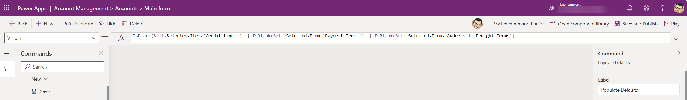

11. All ribbon customizations have now been applied. Click on **Save and publish** to apply your changes. This may take several minutes to complete:

    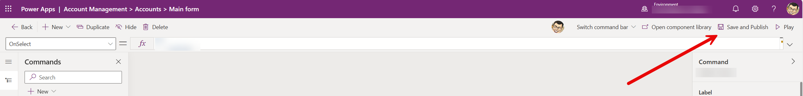

17. Click on the **Play** icon to open the **Account Management** app in a new tab, so we can test our changes:

    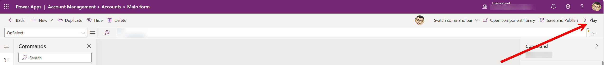

18. In the **My Active Accounts** view, select the **Adventure Works (sample)** record to open the Account form:

    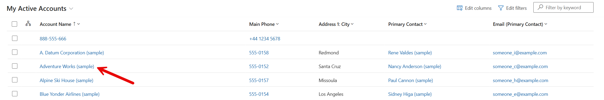

19. Observe that the **Populate Defaults** command is visible on the ribbon. This is because this Account is missing information in the fields we've defined in our formula. We can navigate to the **Details** tab to confirm this:

    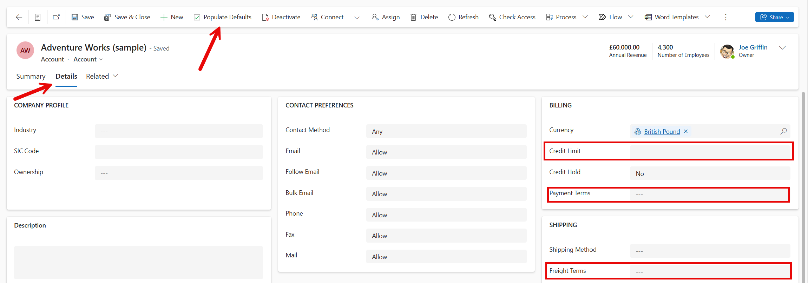

20. Select the **Populate Defaults** command. After a few moments, the formula should execute successfully and we can observe the following:
    - The **Credit Limit** field has been populated with the default value of `1000`.
    - The **Payment Terms** field has been populated with the default value of **Net 30**.
    - The **Freight Terms** field has been populated with the default value of **No Charge**.
    - A notification is displaying at the top of the screen to confirm that the default values have been populated successfully.
    - The **Populate Defaults** command is no longer visible on the ribbon as all fields have been populated:

    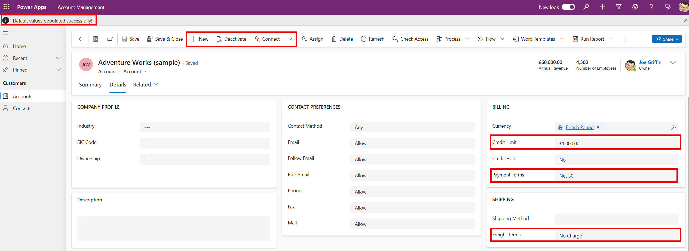

21. Select the **Credit Limit** input and replace the data in the field with `2500`.

22. Clear the data in the **Freight** Terms field by selecting the **--Select--** option from the dropdown.

23. Save the Account record.

    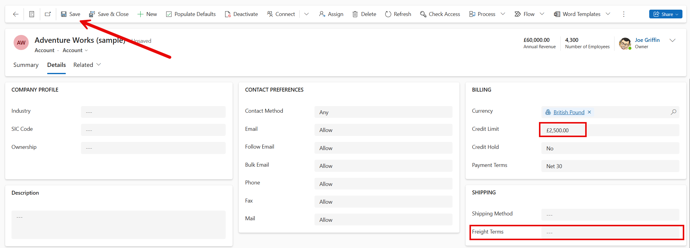

24. Once the save operation has completed, observe that the **Populate Defaults** button is visible again on the form; this is because one of the conditions for it's visibility has been met again (i.e. Freight Terms is empty).

25. Press the **Populate Defaults** button again. This time, observe that the **Credit Limit** value has been correctly retained and not overwritten by the default value. This confirms that our formulas are all working as expected.

26. Continue to experiment with updating values on this Account record, and others, until you are happy the command is working as expected. When you are finished, close the **Account Management** app and command designer windows.

## Exercise 3: Create a Formula Column for the Contact Table

> [!IMPORTANT]
> This exercise assumes that you have completed the previous exercise. If you haven't, complete these steps first before proceeding.

1. Navigate to the [Power Apps Maker Portal](https://make.powerapps.com) and, if not already selected, select the developer environment you created in Lab 0:

    

2. Click on **Solutions** in the left-hand navigation pane and then click on the **Wingtip Toys PP Solution** solution you created in Lab 3:

    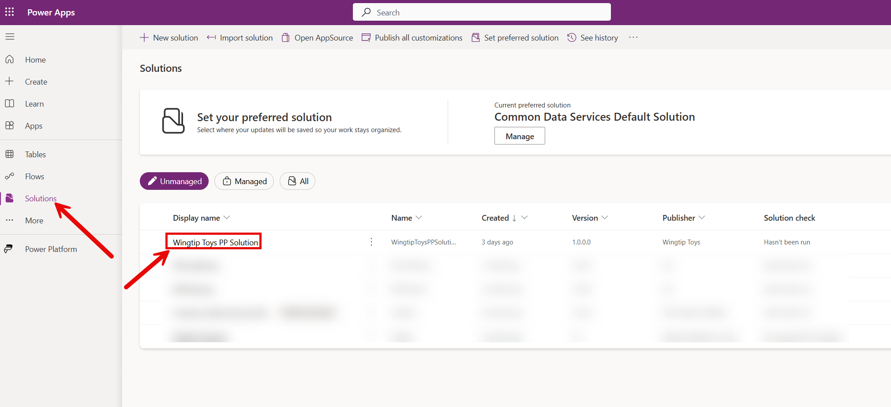

3. On the list of components, click on **Contact**:

    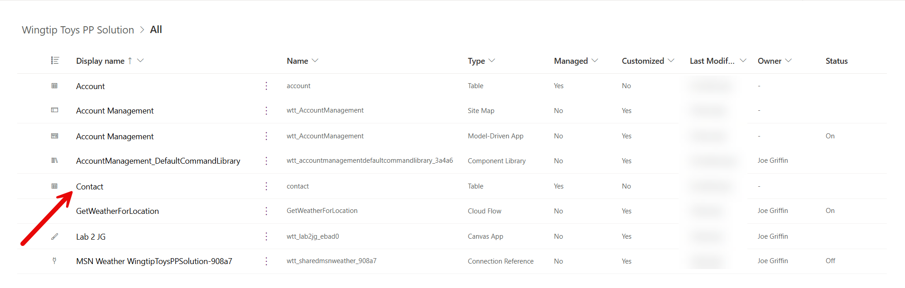

4. On the **Contact** table details, click on **+ New** and then select **Column**:

    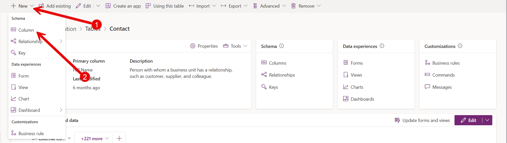

5. On the **New column** form, populate the details as follows and then click on **Save**:

    - **Display name**: `Age`
    - **Description**: `Formula column to calculate the age of the Contact based on their birthday`
    - **Data type**: Formula
    - **Formula**: `DateDiff(Birthday, UTCToday(), TimeUnit.Years)`
    - **Schema name**: `wtt_Age`
    - **Formula data type**: Whole number
    - **Format**: None

    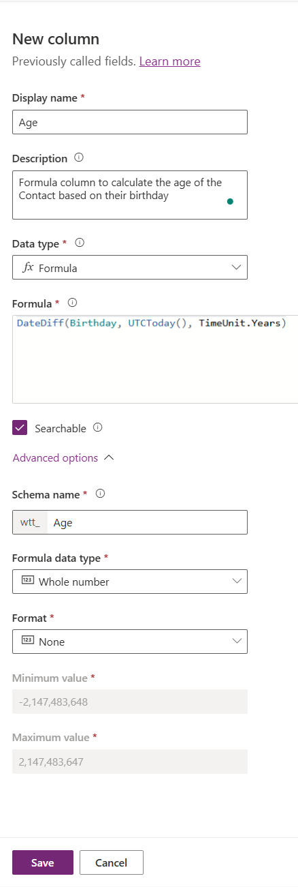

6. We now need to add this new column to the Contact form. Expand the **Contact** option in the **Objects** explorer and select **Forms**:

    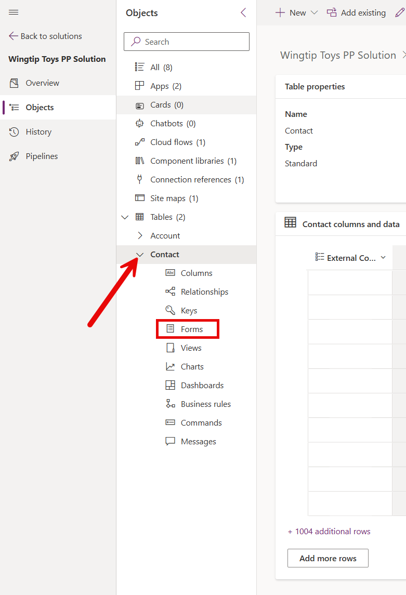

7. Click on **Add existing form**:

    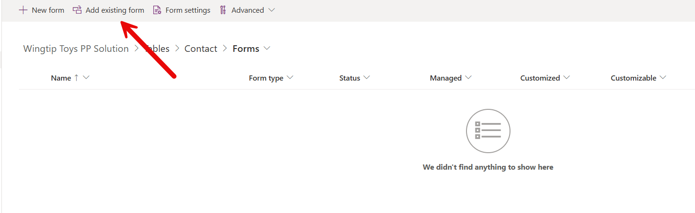

8. Tick the option next to the **Contact** form and then click on **Add**. The form will be added into your solution. Click on it to open the form designer:

    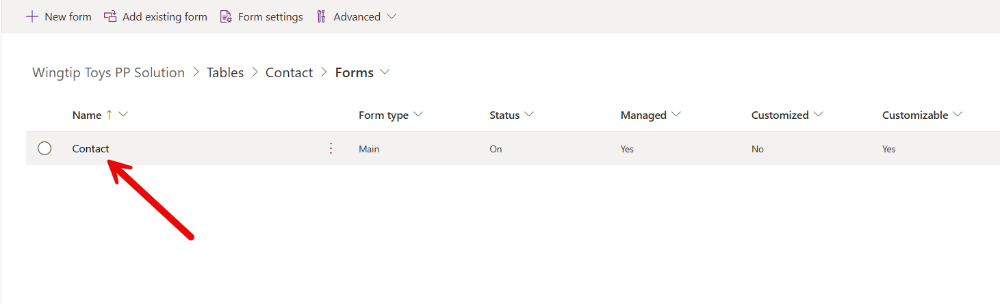

9. In the form designer, click on the **Details** tab:

    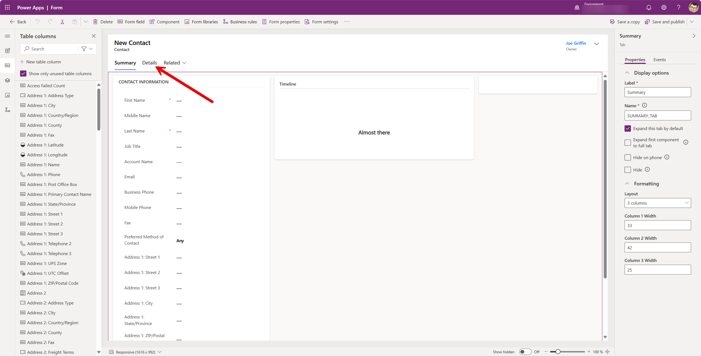

10. Locate the newly created **Age** column in the **Table columns** list. Once located, drag and drop the column so it's positioned underneath the **Birthday** column:

    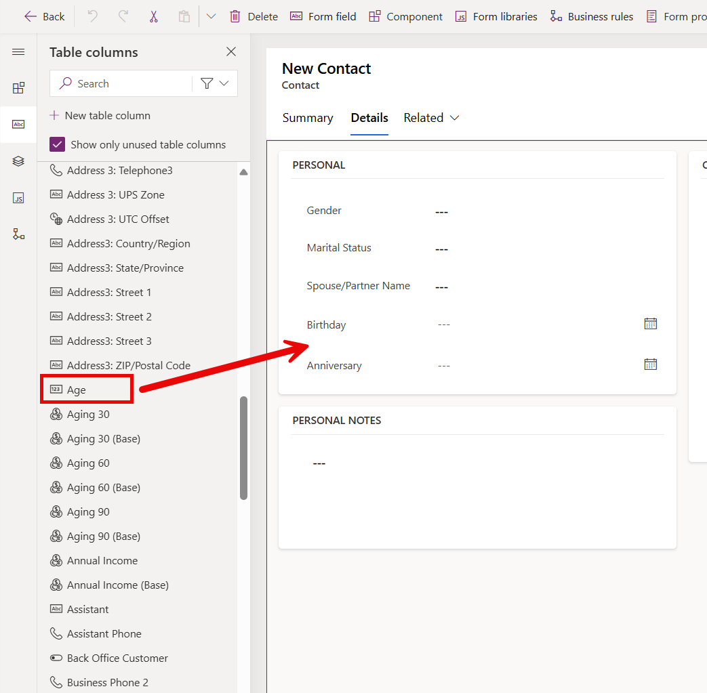

11. The form designer should resemble the below if done correctly:

    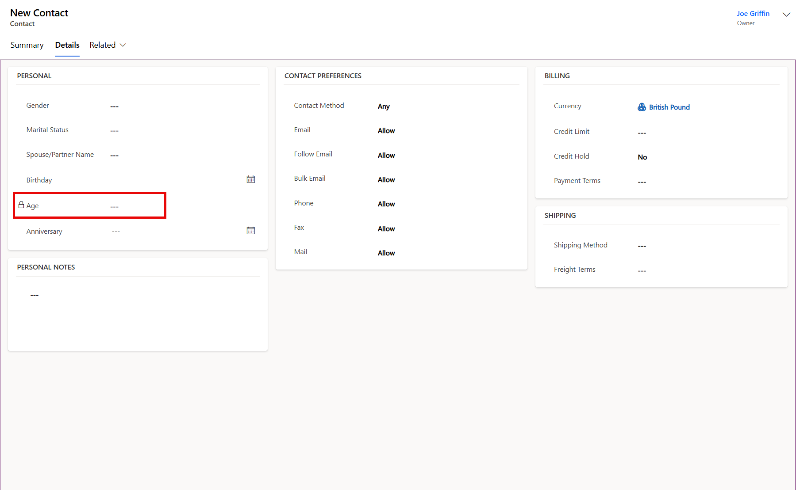

12. Save and publish your changes by clicking the **Save and publish** icon in the top right-hand corner of the screen. Once this is complete, click on the **Back** button to return to the solution view:

    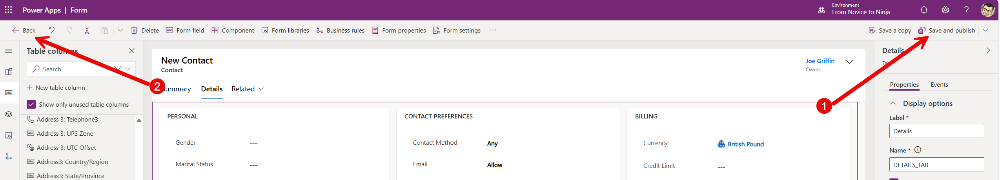

13. It's now time to test our changes. In the solution view, click on **Apps**, select the **Account Management** app and then click on the **Play** icon to open the app in a new tab:

    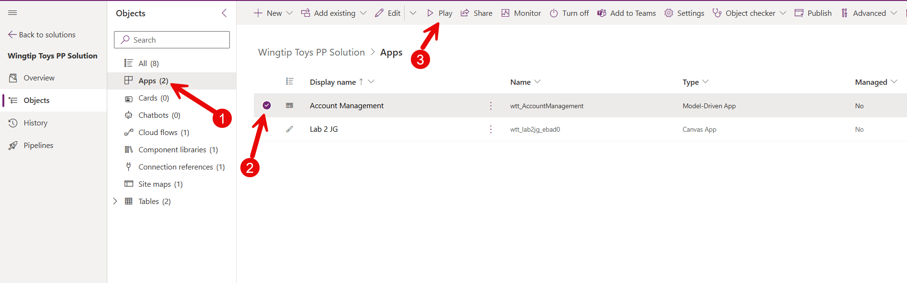

14. In the **Account Management** app, click on **Contacts** and then select any Contact from the **My Active Contacts** view:

    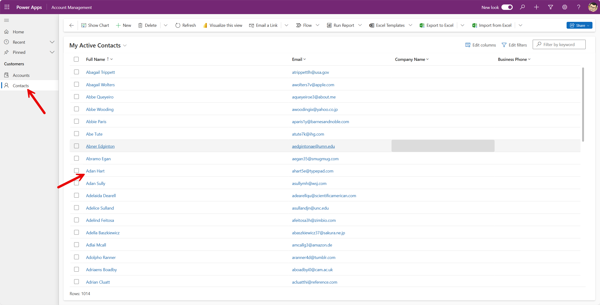

15. Click on the **Details** tab and verify that the **Age** column is displaying and that the age of the Contact is being calculated correctly based on their birthday:

    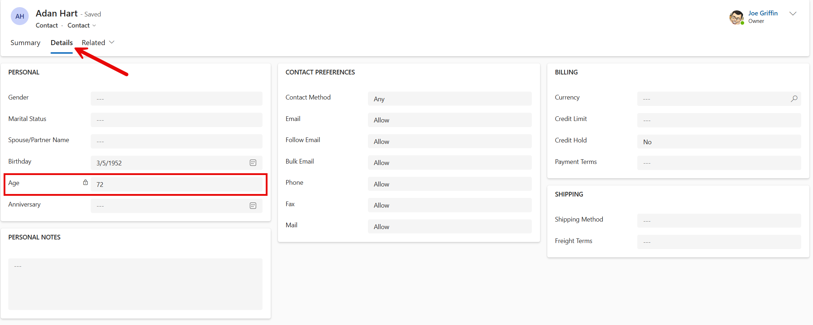

16. Experiment with updating the **Birthday** of the Contact and saving the record. Observe how the **Age** column updates automatically after each save operation. When you are finished, close the browser tab to return to the solution window.

> [!IMPORTANT]
> Formula columns always calculate their value when a record is retrieved in the system (i.e. whenever the **Retrieve** or **RetrieveMultiple** messages are called). This means that the value of the column is not stored in the database, but is calculated on the fly when the record is retrieved. This is useful for scenarios where you need to calculate a value based on other fields in the record, but it's important to be aware of the performance implications of using formula columns, especially in larger Dataverse environments.

17. Leave the solution view open as we will be starting from here in the next exercise.

## Exercise 4: Implement a Low-Code Plug-In

> [!IMPORTANT]
> This exercise assumes you've completed the previous exercise and that you're still in the **Wingtip Toys PP Solution** view. If you are not there, proceed there now.
>
> At the time authoring this lab, low-code plug-ins are still in public preview. You may encounter issues or breaking changes with these instructions. In case of any issues, please speak with your instructor.

1. In the solution view, click on **Back to solutions**:

    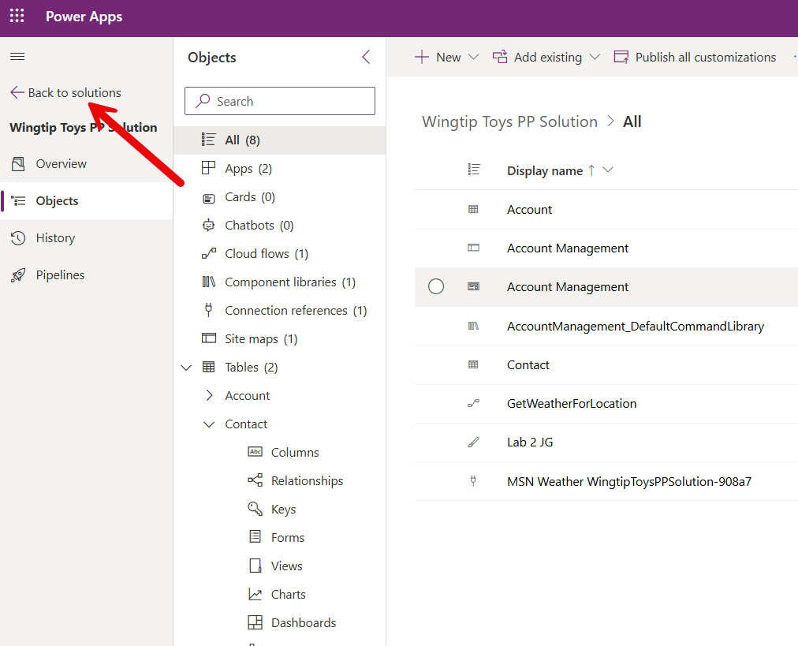

2. On the Power Apps maker portal, click on **Apps**, select the button for **Shared with me** and then play the **Dataverse Accelerator App**. You will need to hover the mouse cursor over the app name for the **Play** icon to appear:

    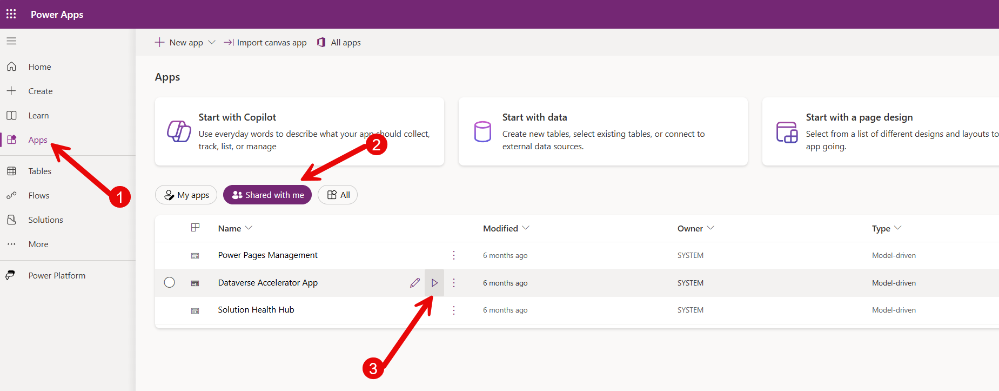

> [!IMPORTANT]
> The Dataverse accelerator provides a seperate interface for customers to trial and experiment with preview features, such as low-code plug-ins. While this functionality is in preview, we must always use the accelerator to create and manage low-code plug-ins. For more information on the accelerator app, [refer to the Microsoft Learn site](https://learn.microsoft.com/en-us/power-apps/maker/data-platform/dataverse-accelerator/dataverse-accelerator).

3. In the **Dataverse Accelerator App**, click on **+ New plug-in** -> **Automated plug-in** in the ribbon:

    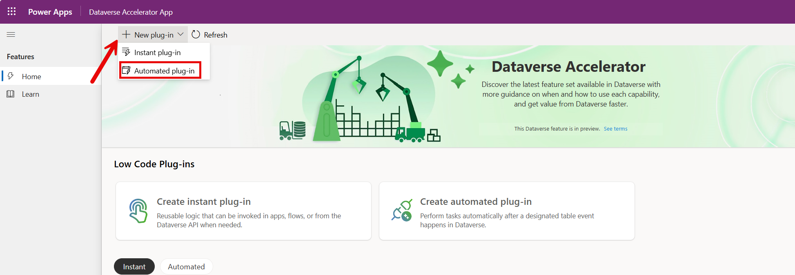

4. On the **New** form, populate the form as indicated below. Note that you will need to expand the **Advanced options** heading to see all fields:
        - **Display Name**: `Validate and Format Contact Telephone Number On Create`
        - **Table**: Ensure that **Contact** is selected from the dropdown.
        - **Run this plug-in when the row is**: Tick the option for **Created**
        - **When should this run**: Select **Post-Operation**.
        - **Solution**: Select the **Wingtip Toys PP Solution** solution.
    
    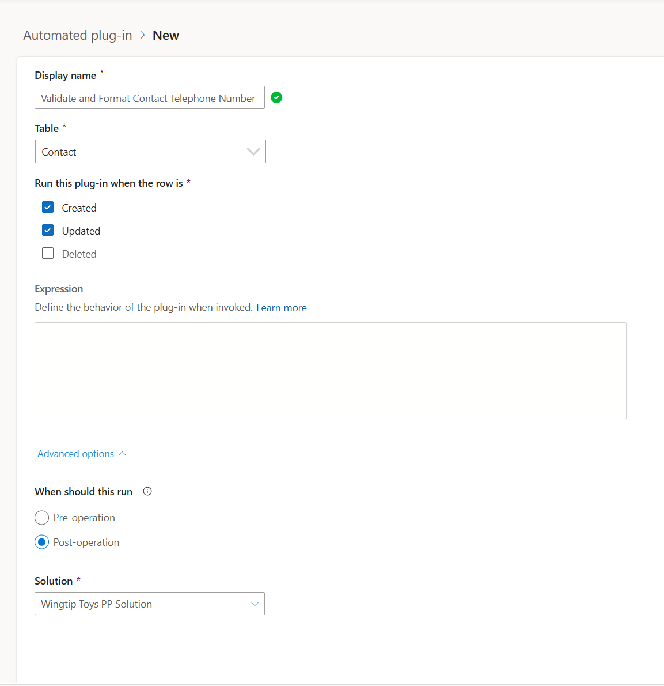

> [!IMPORTANT]
> If the **When should this run** options are not visible, try refreshing the page.
>
> You may receive the following error when changing values in the form; it can be safely disregarded: `A validation error occurred. The value 10 of 'type' on record of type 'environmentvariabledefinition' is outside the valid range. Accepted Values: 100000000,100000001,100000002,100000003,100000004,100000005`

5. In the **Expression** field, add the following Power Fx formula. The formula uses the `IsMatch()` function to validate whether the **Business Phone** entered by the user when creating a Contact is formatted correctly. If not, then the value is substitued and formatted correctly. If a user attempts to create a Contact containing a **Business Phone** of incorrect length or containing letters, an error will be thrown:

    ```
    If(
        !IsMatch(NewRecord.'Business Phone', "^(\([0-9]{3}\) |[0-9]{3}-)[0-9]{3}-[0-9]{4}$"),
        If(
            Len(NewRecord.'Business Phone') = 10 && IsNumeric(NewRecord.'Business Phone'),
            Set(
                NewRecord.'Business Phone',
                Concatenate(
                    "(",
                    Left(NewRecord.'Business Phone', 3),
                    ") ",
                    Mid(NewRecord.'Business Phone', 4, 3),
                     "-",
                    Right(NewRecord.'Business Phone', 4)
                )
            ),
            Error("Invalid telephone number format. Please enter a number that is 10 characters in length and contains numbers only.")
        )
    )
    ```

    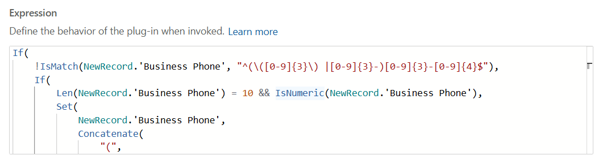

6. Press **Save** to create the plug-in:

    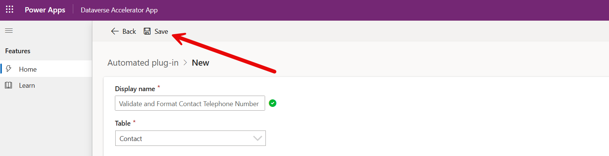

> [!IMPORTANT]
> When saving the plug-in, you may receive the following error message: `An unexpected error occurred while creating FxExpression: It is invalid to create component fxexpression with the same export key value(s) as an existing component. Please change the key. The current value(s) are uniquename: wtt_ValidateandFormatContactTelephoneNumber`. Provided that there is an additional message stating `Plug-in successfully saved`, you can disregard this error.

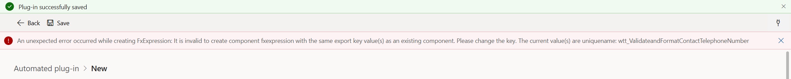

7. Click on **Back** to return to the previous page:

    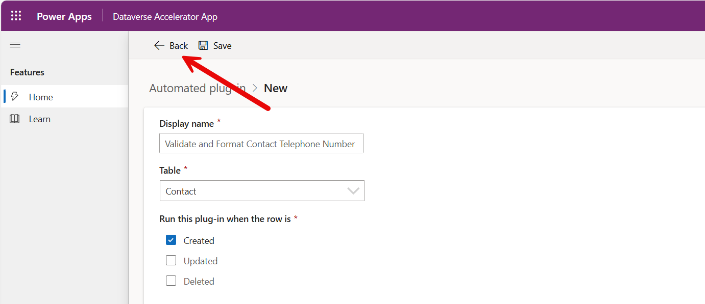

8. We now need to create the plug-in that will trigger whenever a Contact is updated. Click on **+ New plug-in** -> **Automated plug-in** again in the ribbon.

9. On the **New** form, populate the form as indicated below. Note that you will need to expand the **Advanced options** heading to see all fields:
        - **Display Name**: `Validate and Format Contact Telephone Number On Update`
        - **Table**: Ensure that **Contact** is selected from the dropdown.
        - **Run this plug-in when the row is**: Tick the option for **Updated**
        - **When should this run**: Select **Post-Operation**.
        - **Solution**: Select the **Wingtip Toys PP Solution** solution.

    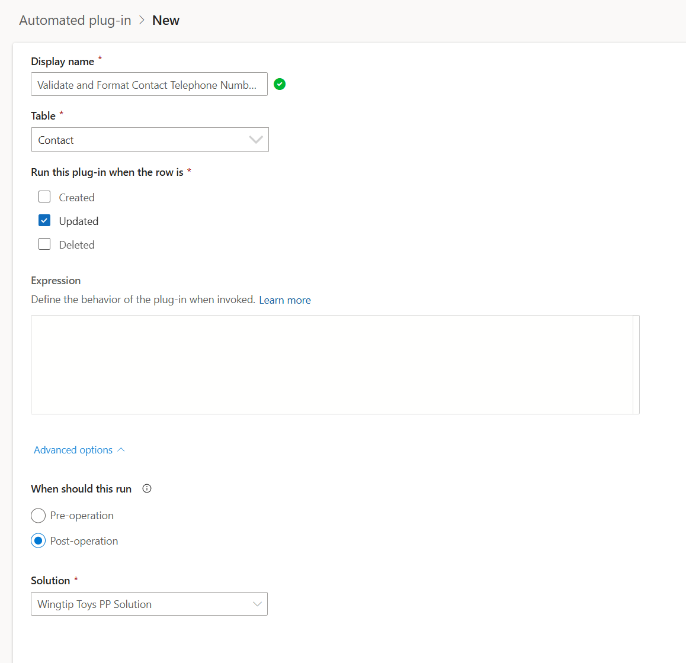

> [!IMPORTANT]
> If the **When should this run** options are not visible, try refreshing the page.
>
> You may receive the following error when changing values in the form; it can be safely disregarded: `A validation error occurred. The value 10 of 'type' on record of type 'environmentvariabledefinition' is outside the valid range. Accepted Values: 100000000,100000001,100000002,100000003,100000004,100000005`

10. In the **Expression** field, add the following Power Fx formula. The formula is virtually identical to the one we used for the **Created** plug-in, but this time, we use `OldRecord` to access details regarding the existing Contact:

    ```
    If(
        !IsMatch(OldRecord.'Business Phone', "^(\([0-9]{3}\) |[0-9]{3}-)[0-9]{3}-[0-9]{4}$"),
        If(
            Len(OldRecord.'Business Phone') = 10 && IsNumeric(OldRecord.'Business Phone'),
            Set(
                NewRecord.'Business Phone',
                Concatenate(
                    "(",
                    Left(OldRecord.'Business Phone', 3),
                    ") ",
                    Mid(OldRecord.'Business Phone', 4, 3),
                    "-",
                    Right(OldRecord.'Business Phone', 4)
                )
            ),
            Error("Invalid telephone number format. Please enter a number that is 10 characters in length and contains numbers only.")
        )
    )
    ```

    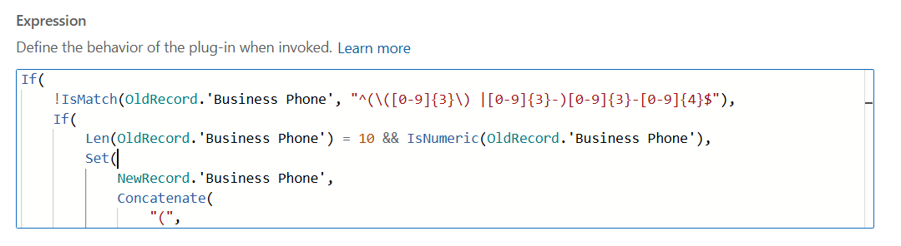

11. Press **Save** to create the plug-in.

12. Click on **Back** to return to the previous page.

13. Click on the **Automated** button and verify that the two plug-ins we created are listed:

    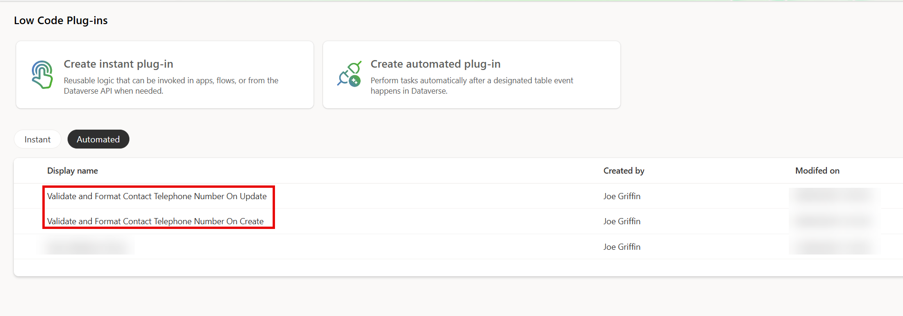

14. Once created, low-code plug-ins will be registered and begin to execute when the conditions we've defined are met. We can now test these plug-ins in the **Account Management** app. Click on the **Dataverse Accelerator App** label on the top of the screen and the select the **Account Management** app in the **App** dialog that appears:

    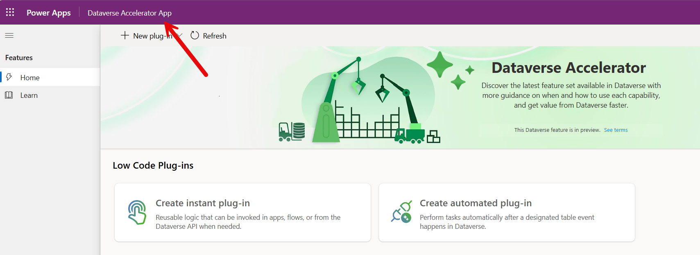

    

15. In the **Account Management** app, click on **Contacts** and then select **+ New** to create a new Contact:

    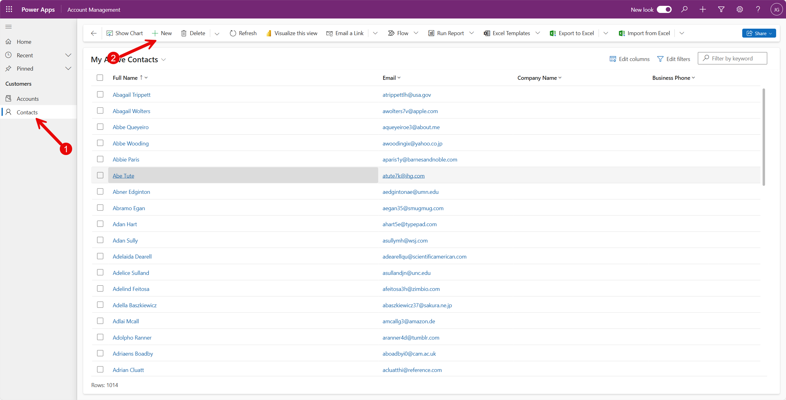

To confirm the plug-in works on Create, we need to test the following scenarios:
- **Scenario 1**: Enter a telephone number in a valid format (e.g. `(123) 456-7890`). The record should save successfully with no error and retaining the correctly formatted telephone number.
- **Scenario 2**: Enter a telephone number in an invalid format, but containing only numbers and of the required length of 10 characters (e.g. `1234567890`). The record should save successfully and format the telephone number correctly.
- **Scenario 3**: Enter a telephone number in an invalid telephone number, containing only numbers but not meeting the length requirements (e.g. `123456789`). We should receive an error message and the record should not save.
- **Scenario 4**: Enter a telephone number that meets the length requirements, but containing a letter (e.g. `123456789a`). We should receive an error message and the record should not save.

16. Proceed to test **Scenario 1** by populating the Contact form with the following values and then pressing **Save**:
    - **First Name**: `Jane`
    - **Last Name**: `Doe`
    - **Business Phone**: `(123) 456-7890`

    

17. The record should save successfully and the **Business Phone** field should retain the value we entered. Press **New** on the ribbon to test the next scenario:

    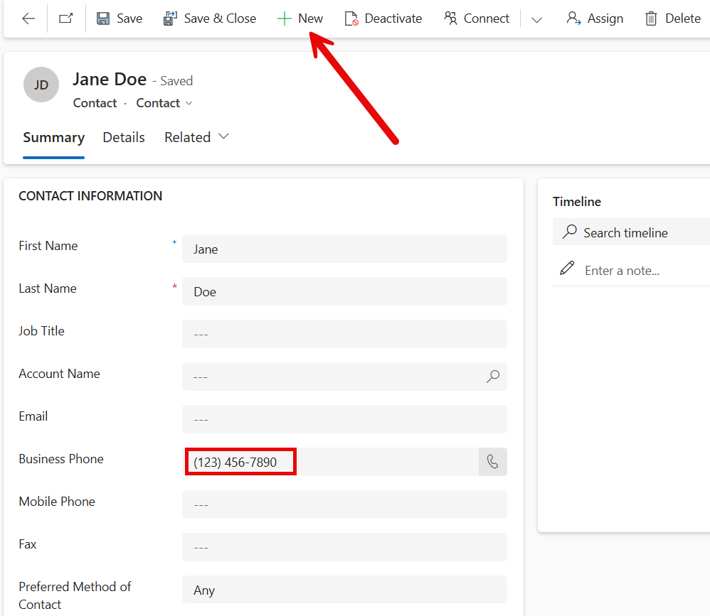

18. Proceed to test **Scenario 2** by populating the Contact form with the following values and then pressing **Save**:
    - **First Name**: `John`
    - **Last Name**: `Doe`
    - **Business Phone**: `1234567890`

    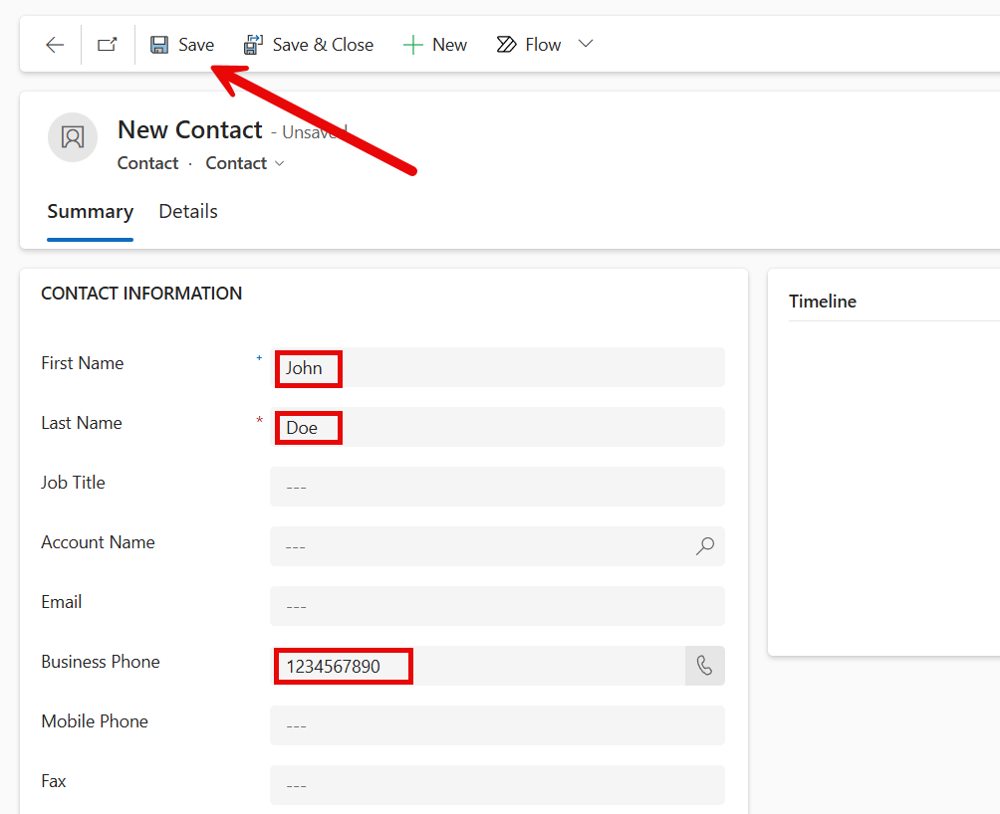

19. The record should save successfully and the **Business Phone** field should be formatted correctly:

    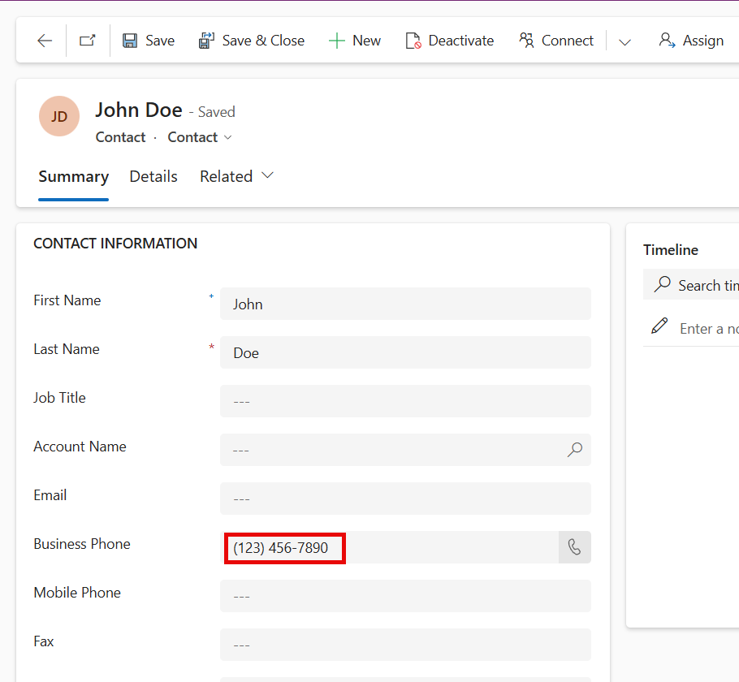

20. Press **New** on the ribbon to test the next scenario. Populate the Contact form with the following values and then press **Save**:
    - **First Name**: `Joe`
    - **Last Name**: `Sixpack`
    - **Business Phone**: `123456789`

21. This time you, you should receive an error message, confirming that the plug-in validation is working correctly. Press **OK** to dismiss the dialog. Observe that we are prevented from saving the record, due to the error:

    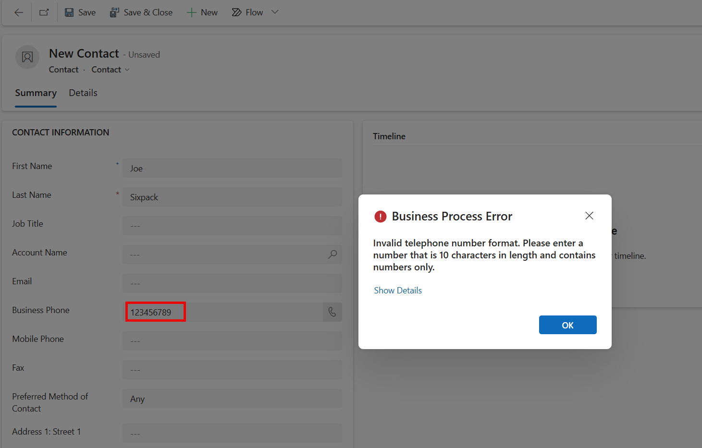

22. On the **New Contact** form, replace the **Business Phone** value with `123456789a` and then press **Save**. Confirm that again you receive an error message and are prevented from saving the record. Press **OK** again to dismiss the dialog:

    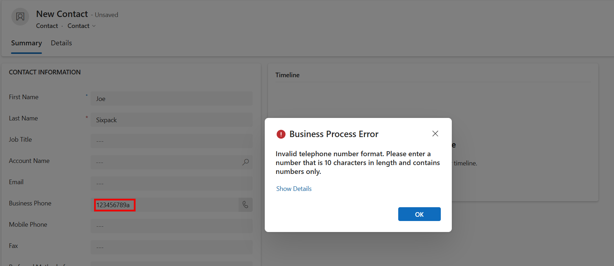

23. Click the back arrow on the browser and, when prompted about unsaved changes, click **Discard changes**:

    

24. You should now be on the **John Doe** Contact record created in step 18. Proceed to test the same scenarios in steps 16-22 for the **Updated** plug-in by supplying a mixture of valid and invalid values. Keep testing until you are satisified the plug-in is working as expected.

25. Close the **Account Management** app when you are finished testing.

## Exercise 5: Embed the Canvas App into the Model-Driven App

> [!IMPORTANT]
> This exercise assumes you've completed all steps in the previous exercise.

1. Navigate to the [Power Apps Maker Portal](https://make.powerapps.com) and, if not already selected, select the developer environment you created in Lab 0:

    

2. Click on **Solutions** in the left-hand navigation pane and then click on the **Wingtip Toys PP Solution** solution you created in Lab 3:

    

3. In the **Objects** view, expand the **Tables** option, then **Account** and then select **Forms**:

    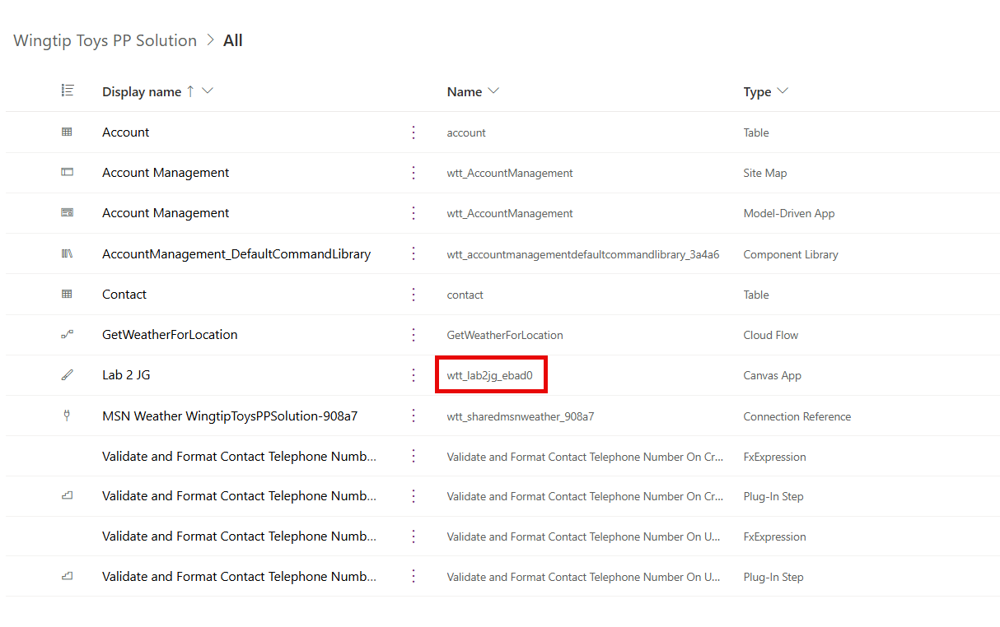

4. Click on **Add existing form**:

    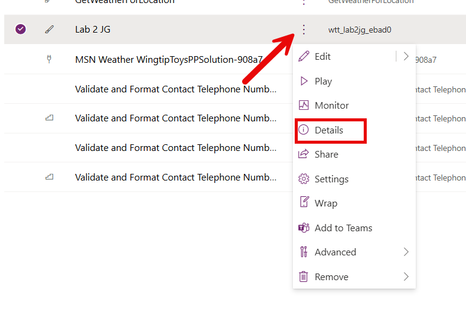

5. Tick the option next to the **Account** form and then click on **Add**. The form will be added into your solution. Click on it to open the form designer:

    

    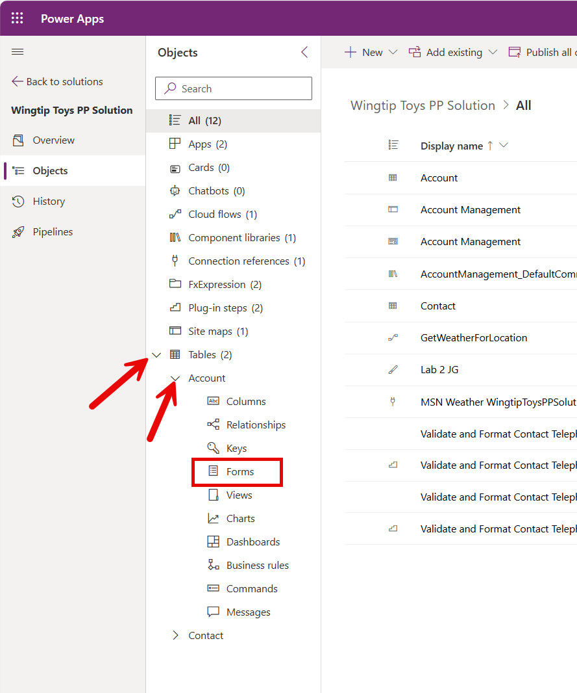


**Congratulations, you've finished Lab 4** 🥳